# 导学
## 导学
- 为什么要有这个导学课程
    + php课程有一定的难度
    + 每个人的基础不太一样，有的同学有计算机基础，有的同学并没有计算机基础，为了让大家学习进度尽量保持一致
    + 对整个课程要学的东西大概有一个认识，避免在学习的过程当中总是不知道在干嘛，造成不想学的情况
- 大家在来传智的时候，好多同学应该不是一上来就选择的前端这个专业，肯定在很多专业之间挑选过，大家回想一下，传智还有哪些课程??(只考虑编程方面的)
    + java,php,python,前端


从大的方面来划分的话：可以划分为前端与后端

- 如何理解前端与后端


--> 感性认识前端与后端
- 一个国家，从大的层面上来划分
    + 开辟新疆土 ---> 武将 ---> 前端
    + 后勤、守城者 ---> 主要是文官体系 ---> 后端
- 一个公司，从大的层面上来划分
    + 找客户的：业务员、销售员 ---> 前端
    + 生产产品的：生产工人、HR、财务... ---> 后端

- 我们通过如下的图示来理解一下整个过程：

大家这块可以思考一下，我们在没有学习前端之前，平时上网的习惯是什么样子的：
在地址栏输入一个网址，然后按下回车即可，我们就可以拿到我们想要的内容

真的是这么简单吗？其实不是的

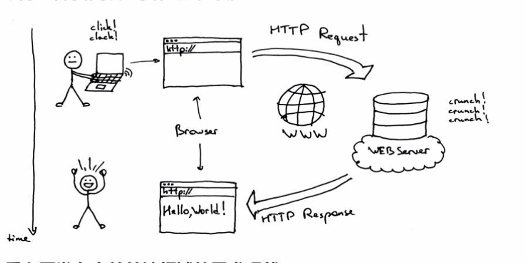

大家可以想一下，上图的整个流程其实我们现实生活中经常会遇到，比如去商店去买东西，我们是客户，商店为我们提供服务。

这块大家可以来看一下：
某商店某商品 ---> 客户向商店的服务员发送一个请求，想要某个商品，那我们的服务员就会找到对应的商品然后拿给我们用户

www.baidu.com/a.js ---> 客户端向服务器发送一个请求，想要一个a.js的文件，服务器找到之后就会返回一个js文件

在上图当中，前端关心的是用户看到的东西，而后端是侧重于为客户端用户提供服务，当有客户端来请求的时候，我们根据用户的请求来找到相应的资源文件，并且把对应资源返回给我们的前端

前端关注点：已经拿到了js,html,css这些文件，怎么把页面搞好看一些
后端关注点：给前端浏览器提供服务，一个浏览器请求过来了，要解析理解客户端浏览器需要什么类型资源，然后找到对应的资源以后返回给前端浏览器


那我们从上面的理解，我们就可以得出如下的结论：
---> js是用来做前端的
---> php就是用来做后端的


我们为什么要学习php呢?

---> php的历史
	http://php.net/manual/zh/history.php.php ---> 一门古老的语言

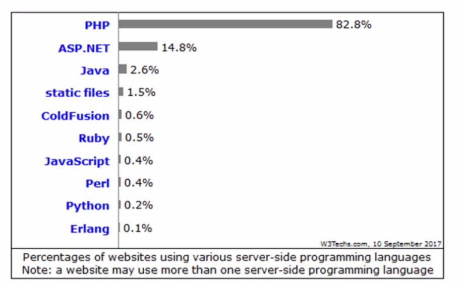

从php的历史和php的市场我们可以得出来的结论是：
1、我们的php的应用是很广泛的，我们以后去找工作的时候，很大概率我们公司的后端会遇到这门语言

- 学习php的作用
    + 后面的ajax课程相当重要，这个东西学好了对我们后面的课程和将来找工作都是很重要的一块知识点，php课程是为ajax课程来打基础，来服务的
    + 让大家从此以后对整个互联网的前端、后端在做的事情有一定的理解（以后去公司之后，不会说不知道公司的java,php等工程师在干嘛，便于我们以后更好的与同事进行配合）
    + 说不定有一天，大家对后端感兴趣了，想转行也有一个基础

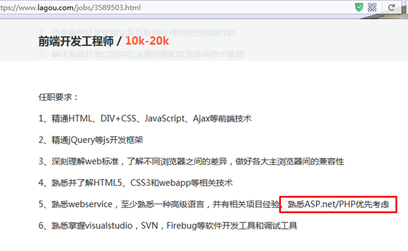

正如我们看电影，必须要安装播放器一样，播放器是电影提供一个播放的环境，php的运行也需要一个环境，我们的php必须在服务器端软件才能运行

这里面我首先给大家演示一下，我们第一种方案，可以去购买一个域名，然后去购买一个虚拟主机，然后的话，我们把它们配置好之后，就可以把我们的东西传上去，然后，就可以通过我们的网址进行访问（测试一下是否能正常的玩），大家在体验的时候有没有发现，最终的结果，是和大家平时上网的时候体验是一样的。

- 试验一下能不能访问我购买的虚拟主机
    + 购买域名和主机.doc
    + 大家以后学完了以后也可以自己购买，到时候在找工作的时候，可以提前把自己做的东西放上去

但是我们现在阶段是在学习，那我们没有必要花钱来买域名和服务器，我们这里面就把自己的电脑当成了是服务器，把我们同桌的电脑或者说自己的电脑来当客户端来玩的。
一般的我们如果真的专门来学习php的话，我们需要手动的进行安装，像apache,php,mysql软件，然后对环境进行配置，但是这样的话就太麻烦了，如果我们这样做，可能一天时间都有可能有些同学配不出来环境，这里面为了简化我们的学习难度，我们这里用的是一个集成包软件叫phpStudy(先安装好这个软件，再来理解服务器是怎么回事)

- 安装phpStudy软件

- 如何理解phpStudy软件
    + phpStudy是一个服务器端软件

- 如何理解服务器端
    + 大家第一次听说服务器应该是在网游世界中听到的
    + 我们直观的印象是
        1. 玩游戏下一个客户端
        2. 玩游戏必须要联网
        3. 玩游戏必须要登上服务器
    + 服务器：提供服务，就像一个商店一样，有人需要什么东西，服务员就去找一找有没有这个东西，如果有，就找出来给他
    + 客户端：类似QQ、手机上的网游之类的都叫客户端

其实大家这块可以看一下，我们的控屏软件，我电脑上安装的其实就是服务器端，大家电脑上安装的其实就是客户端


既然我们的环境已经是配置好了，接下来，我们就来写一些简单的php代码来让大家入门


- phpStudy是服务器端，浏览器是客户端
    + 做实验
        1. 打开WWW根目录
        2. 在里面创建一个1.html文件
        3. 通过ipconfig命令获取自己电脑的ip地址
        4. 通过浏览器进行访问这个文件
        5. 把url地址发给同桌，让别人也访问一下看能不能访问
        6. 体会一下，这整个过程做完以后，我们访问这个页面的过程是不是和平时上网是一模一样的？

- 实例一

- 实例二
    + php语句都必须以分号结尾，否则会报错

- 实例三

- 实例四

- 实例五

- 实例六

- 实例七

- 实例八

- 实例九

接下来再来思考一下这个问题：
我们平时去新浪看新闻的时候，我们会发现一个情况，每天都会产生新的一些新闻，那一个新闻就会对应一个页面，我们想一下会不会真的有很多很多的html页面呢?

这里面就引出来了两个概念：静态资源与动态资源(一定要理解，相当重要)
    + 所谓的静态资源，就是我们写好的东西，然后以后基本上不会变的，我们直接扔到服务器，然后客户端就可以进行访问的东西(写死的html,js,css,jpg)
    + 动态资源(实验)

大家可以思考一下：


像如上的网页上的东西，会不会是前端人员写好代码之后，直接放到服务器上就可以呢？
肯定不会的，因为我们平时在网上买的东西，都是有对应的库存的，卖一件少一件，事实上，这种东西是动态的，我们一般称之为动态资源,如下图所示：

大家可以这样来理解：
静态html文件 = 写死了直接放到服务器上的东西
动态文件 = 页面的一个框架结构html代码+数据

我们的数据一般的来自于一个叫数据库的地方

这里写一个小的demo,演示一下当传入的参数不一样的时候，对应的网页内容不一样，同时如果我们修改了数据之后，内容也会发生变化

```php
<?php
header('content-type:text/html;charset=utf8;');
$arr = [
    ["id"=>1,"title"=>"第一篇新闻",'content'=>"第一篇新闻的内容"],
    ["id"=>2,"title"=>"第二篇新闻","content"=>"第二篇新闻的内容"],
    ["id"=>3,"title"=>"第三篇新闻","content"=>"第三篇新闻的内容"],
    ["id"=>4,"title"=>"第四篇新闻","content"=>"第四篇新闻的内容"],
    ["id"=>5,"title"=>"第五篇新闻","content"=>"第五篇新闻的内容"],
    ["id"=>6,"title"=>"第六篇新闻","content"=>"第六篇新闻的内容"]
];
($id = @$_GET['id']) or ($id = 1);
// print_r($arr[$id-1]);
?>
<!DOCTYPE html>
<html lang="en">
<head>
    <meta charset="UTF-8">
    <meta name="viewport" content="width=device-width, initial-scale=1.0">
    <meta http-equiv="X-UA-Compatible" content="ie=edge">
    <title>Document</title>
</head>
<body>
    <?php if(empty($arr[$id-1])){?>
        <h1>访问的内容不存在</h1>
    <?php }else{?>
        <h1><?php echo $arr[$id-1]["title"];?></h1>
        <p><?php echo $arr[$id-1]["content"];?></p>
    <?php } ?>
</body>
</html>
```


我们理解了前端与后端之后，就可以理解如下这张图：

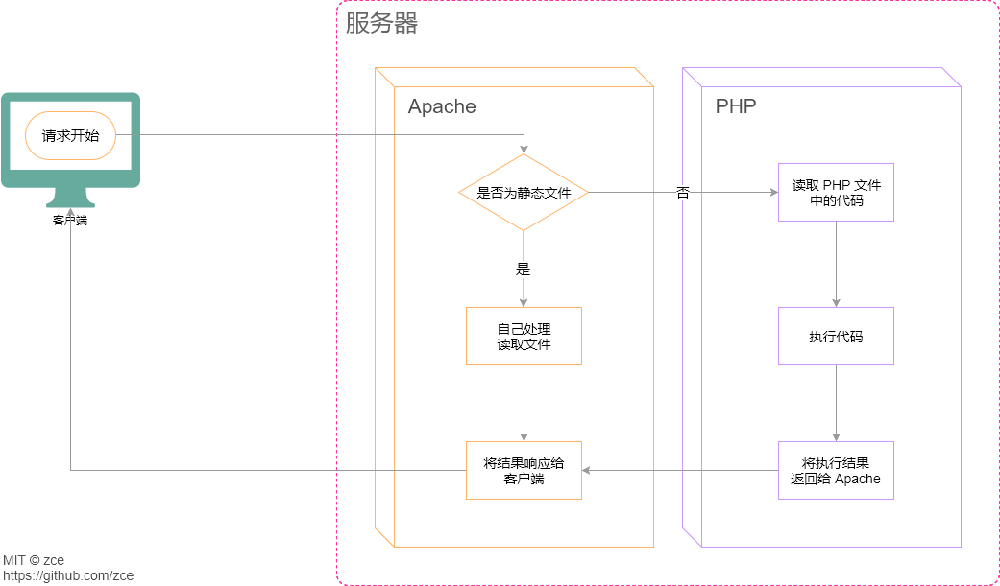

结论：
1、如果用户请求的是html,js,css之类的静态资源，php后台会直接返回给客户端
2、如果用户请求的是php文件的动态资源，php后台的作用根据用户要请求的数据，从数据库中找到对应的数据，拼接成一个完整的html内容，然后返回给客户端。

再来思考一下，其实我们平时上网，除了浏览页面，还有一个功能是登录注册之类的：

表单上传综合

回顾一下之前学过的表单输入框
1. input[type="text"]
2. input[type="password"]
3. input[type="radio"]
4. input[type="checkbox"]
5. input[type="file"]
6. input[type="number"]
7. input[type="color"]
8. select > option
9. input[type="hidden"]

```html
<!DOCTYPE html>
<html lang="en">
<head>
    <meta charset="UTF-8">
    <meta name="viewport" content="width=device-width, initial-scale=1.0">
    <meta http-equiv="X-UA-Compatible" content="ie=edge">
    <title>Document</title>
</head>
<body>
    <input type="radio" checked>
    <input type="checkbox" checked>
    <select name="" id="">
        <option value="a">a</option>
        <option value="b" selected>b</option>
    </select>
</body>
</html>
```

总结：radio,checkbox选中用checked,select复选框用selected

思考：我们都有博学谷账号，我们的账号密码是存在哪里的?

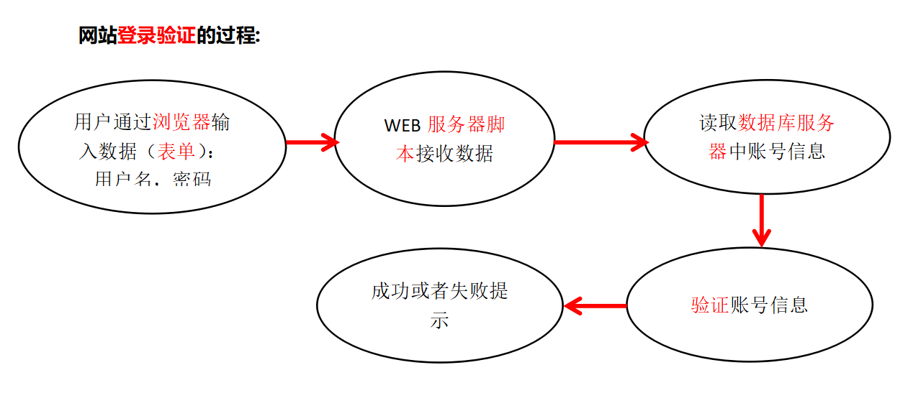

这里给大家演示一下$_POST

```php
<!DOCTYPE html>
<html lang="en">
<head>
    <meta charset="UTF-8">
    <meta name="viewport" content="width=device-width, initial-scale=1.0">
    <meta http-equiv="X-UA-Compatible" content="ie=edge">
    <title>Document</title>
</head>
<body>
    <form method="POST">
        <input type="text" name="name">
        <input type="password" name="password">
        <input type="submit">
    </form>
</body>
</html>
```

我们加上如下的代码：

```php
<?php 
if(!empty($_POST)){
    print_r($_POST);
}
?>
```

总结：
1、php可以用来处理表单数据
2、php可以用来操作数据库中的数据
3、php可以向客户端返回动态资源

## 自学内容
- pre标签

```html
<!DOCTYPE html>
<html>
<head> 
<meta charset="utf-8"> 
<title>菜鸟教程(runoob.com)</title> 
</head>
<body>

	var a = 1;
	var b = 2;
	console.log(a+b);
</body>
</html>
```

对比一下上面的代码和下面的代码的区别


```html
<!DOCTYPE <!DOCTYPE html>
<html>
<head> 
<meta charset="utf-8"> 
<title>菜鸟教程(runoob.com)</title> 
</head>
<body>

	var a = 1;
	var b = 2;
	console.log(a+b);
</body>
</html>html>
<html>
<head> 
<meta charset="utf-8"> 
<title>菜鸟教程(runoob.com)</title> 
</head>
<body>

<pre>
	var a = 1;
	var b = 2;
	console.log(a+b);
</pre>

</body>
</html>
```

- 打字游戏 http://zty.pe

- 单词(php相关单词.md)
    + 学会用有道词典(加入单词本)
    + 学会看报错信息
    + 学会google翻译工具

```
Warning: Division by zero in C:\Users\zhengwei\Desktop\server\www.test.com\ceshi.php on line 4
```

## 编辑器
    1. vsCode(讲义中有推荐的php等相关的插件)
    2. sublime(大家自行百度相关的php插件 不推荐使用)
    3. phpstorm(太大，类似webstorm) http://www.oyksoft.com/soft/40722.html?pc=1

## 学习注意事项
0. 这个课程是php学院老师录的，难度系数有一点高，对于咱们前端来说没必要掌握这么多php的细节的，有些知识大家听一下了解即可
1. 前三天要记的东西不少 
    ---> 善于和js类比，你会发现好多东西以前学过，只不过换了一种形式，其实记的东西并不多的
    ---> 记忆卡片、单词本
    ----> 毕竟咱们学的是前端，不是专门搞php的，不用焦虑，大概知道，用的时候知道去哪查
2. 第四天数据库命令 -->多练习
3. 第五天 文件上传比较繁琐 --> 用法固定，笔记记好即可
4. 项目 --> 照着我写好的文档练习即可

# day01
## 重难点
- 配置虚拟主机
- 变量的数据类型
- 打印输出

## php是用来做什么的(15:03)
- php是用来做后台的(服务器端语言)

## web基本概念(web服务器、软件架构、ip地址、域名)(15:33)
- 静态资源与动态资源
    + 这个东西咱们昨天的时候讲过的
- 服务器端与客户端(浏览器端)
    + 这个东西咱们昨天的时候讲过的
- ip地址与域名
    + 如果我们想算圆的面积，可能用得到3.14159....,但是我们没有人记得住，所以，我们会这样做：var pi = 3.14159..,这样定义好之后，下次，我们直接用pi这个变量即可
    + 域名也类似一个变量，我们买了域名，然后让域名和我们的ip地址关联好之后，以后，直接可以通过域名进行访问
    + ping命令可以知道域名和Ip一一对应的关系的
    + ipconfig
    + 127.0.0.1
    + 192.168开头为当前局域网的地址
    + 怎么理解二级域名
    + 大家可以去www.zhujiwu.com  或者www.aliyun.com来看一下一个域名多少钱

## web基本概念(dns、端口)(11:25)
- dns的作用

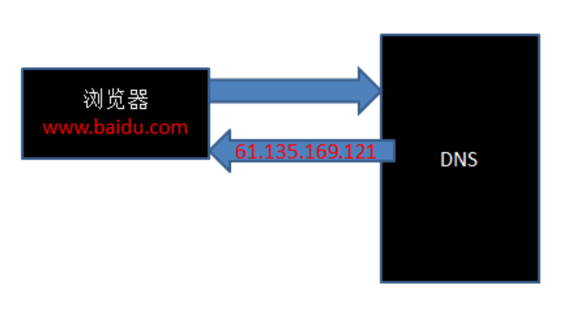

- hosts修改
    + 尝试访问itcast.net
    + 如何理解hosts:本地的dns解析映射文件
    + 在hosts中添加一行：127.0.0.1 itcast.net，再次访问itcast.net查看效果
    + host这个文件是病毒或者木马最喜爱修改的东西，所以360等修复软件最先检查的也是这个文件。大家在配置的过程中，尽量把杀毒软件退出

- 理解：
    + 实际上找到一台电脑用的是ip地址
    + ip地址太难记了，所以需要让ip地址对应一个域名，因为域名更好记
    + 输入的虽然是域名，但是在找服务器之前，会先通过dns,hosts之类的找到对应的ip是多少
- 端口
    + 通过商场的例子来理解端口


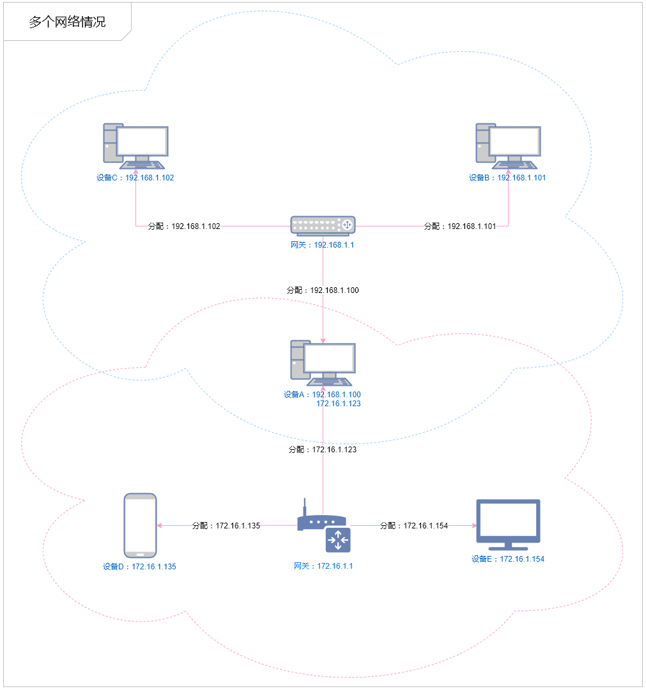

## web基本概念(url、web程序的访问流程)(6:39)
- url的组成
    + 这块可以看一下百度的网址
        1.协议+域名+目录+文件名+查询参数(?a=1&b=2&c=3)
- web程序的访问流程
    + 静态：请求 ---> 找到对应的静态资源 --> 响应
    + 动态：请求 ---> php从数据库中找到对应的数据 --> 与对应的模板组成最终的页面 --> 响应

### 请求与响应的访问流程

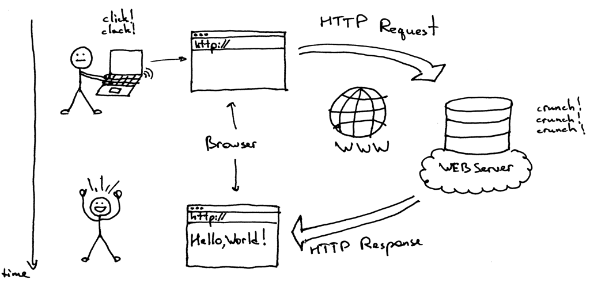

- 用户打开浏览器
- 地址栏输入我们需要访问的网站网址（URL）
- 浏览器通过 DNS 服务器 获取即将访问的网站 IP 地址
- 浏览器发起一个对这个 IP地址的 请求
- 服务端监听指定的 端口 的服务器软件接收到这个请求，进行相应的处理
- 服务端将处理完的结果返回给客户端浏览器（响应）
- 浏览器将服务端返回的结果呈现到界面上

## phpStudy安装(不放)
    + 东八区的配置(不设置的话，会有警告提示信息，同时时间会差8小时)
        1. 其他选项 --> 打开配置文件 --> php.ini --> date.timezone = PRC --> 重启
```php
echo date('Y-m-d H:i:s');
```
    + 切记：修改任何配置项，一定要重启服务器软件


## 配置虚拟主机
0. 如何理解虚拟主机
    + 虚拟主机是指在网络服务器上分出一定的磁盘空间，用户可以租用此部分空间，以供用户放置站点及应用组件，提供必要的数据存放和传输功能。
    + 服务器相当于你自己的房子，虚拟主机相当于你租用别人的房子，并且还是租的单间。
1. 其他选项 --> 打开配置文件 --> httpd.conf --> LoadModule vhost_alias_module modules/mod_vhost_alias.so前面的#号去掉
2. 其他选项 --> 站点域名管理 --> 新增 --> 保存
    + 练习
        1. www.ali.com
        2. www.test.com
        3. oa.test.com
3. hosts文件添加对应的域名和ip(127.0.0.1)的映射

4. 在vhosts.ini中添加如下两行

```
<VirtualHost *:80>
    DocumentRoot "C:\Users\zhengwei\Desktop\server\www.ali.com"
    ServerName www.ali.com
  <Directory "C:\Users\zhengwei\Desktop\server\www.ali.com">
+      Options indexes FollowSymLinks ExecCGI
+      DirectoryIndex index.html index.php
      AllowOverride All
      Order allow,deny
      Allow from all
     Require all granted
  </Directory>
</VirtualHost>

```
5. 重启服务器

### 练习对应的参考视频(这块大家如果不太会看着我的视频来操作)
+ 配置虚拟主机.wmv

## php基本语法(开始结束标记、注释)(8:52)
- 文件名、文件夹名一定不能是中文，否则会出问题(可以演示一下)
- php与html混写(开始结束必须都要有)
- 纯粹php代码(结束可以不写,这个大家了解即可，为了不出问题，建议大家开始结束全部写上)
- 注释和js方式一样(以#号这种平时基本上没有人用的)
- 学习技巧
    + 注意js和php的不同点即可，相同的地方不用学习

```php
<?php --> 代表接下来属于php的世界
//php代码写在这里
?> --> 代表php代码结束了
```

### 练习
1. 练习写开始、结束标记

```php
<?php
echo "hello world";//类似console.log('hello world') 区别在于console.log会打印到控制台，而echo会从服务器打印到客户端浏览器
?>
```

2. 练习注释

```php
<?php
//这是单行注释
/*
这是多行
注释
*/
echo "hello world";
?>
```

3. echo打印br标签理解其作用

4. 练习php和html混写


## 变量基本操作(变量命名规则、命名规范、unset)(19:50)
- 命名规则(这个不用记，其实和js是一样的，只不过多了一条规则：最开始要以$开头)
    1. 必须是以$开头
    2. 必须只能是由数字、字母、下划线组成
    3. 开头不能是数字
    4. 区分大小写
- 命名规范
    + 小驼峰 $studentName = 'jack'
    + 大驼峰 $StudentName = 18
    + 下划线命名法 $student_sex = 1
- unset

```php
<?php
$a = 1;//声明和赋值$a这个变量
echo $a;
$a = 2;//在修改$a变量的值
echo $a;
?>
```

```php
<?php 
$a = 100;
echo $a;
unset($a);
echo $a;
?>
```

### 练习
- 练习定义一个变量并把它打印出来
- 练习unset函数使用之后再打印的结果

## 变量打印输出以及类型获取(23:15)
- 关于打印js只有console.log,而php相对复杂一些
- echo(用得最多，类似console.log)
    + echo true;结果是1
    + echo false;结果是空
- print(和echo作用一样，用得不多)
- print_r(用来打印数组)
- var_dump(类似typeof,可以打印值和类型)


复习一下js中变量的类型
1. number
2. string
3. boolean
4. null
5. undefined
6. object(特殊的对象类型 --> 数组array --> 函数function)

## php变量类型及整型(21:09)
### 变量类型
- 整型
- 浮点型
- 布尔型(不区分大小写 TRUE True TRue TrUe)
- 字符串
- null(不区分大小写 Null NULL null) php中只有一种空
- 资源类型
    + 把数据库连接代码抄写一遍，提前熟悉一下整个过程

```php
$host = 'localhost';//数据库服务器主机名
$user = 'root';//数据库服务器用户名
$password = 'root';//密码
//与数据库建立连接，成功返回资源类型数据，失败返回FALSE,类似和别人聊天先要打电话把电话打通建立连接
$link = mysql_connect($host,$user); 
var_dump($link);   
```

资源类型其实和现实生活蛮像的，我们经常会问朋友，你有啥资源?这个资源肯定不会是简单的数据类型：字符串、布尔型之类的，我们这里从数据库中取一堆东西，也只能说是资源类型的东西

### 什么情况下值为null(类似于js中的undefined)
- 通过变量赋值明确指定为变量的值为NULL
- 一个变量没有给任何值
- 使用函数unset()将变量销毁掉

## 浮点型、布尔型(18:31)
- 浮点型就是小数类型，一般用float,double表示
- 浮点型在运算的时候有可能出现精度的问题，导致如果进行比较的时候有问题，这块了解即可(0.2 + 0.4 ---> 0.60000000001)
    + 参考网站：http://0.30000000000000004.com
    + 一句话理解：计算机没办法百分百还原一个无限小数位的数
- 因为随着测量和数据的需要，我们需要更加精密的描述，如开根号2。在数学中，我们叫科学计数法。计算机中同类型的东西被称为浮点型。记住，它的存在意义和价值是计算的精度，双精度比单精度更精密，但同时更耗空间 float(单精度) double(双精度)
- isset:变量未赋值或者值为null,返回为false,其他返回为true
- empty:判断变量是否为空，"",0,'0',0.0,NULL,false,[]时，为true(如何记忆：一堆各种0，布尔值false和数组长度为0时)


```php
<?php 
header('content-type:text/html;charset=utf8');
$a = "";
var_dump(empty($a));
echo '<br>';
$b = 0;
var_dump(empty($b));
echo '<br>';
$c = 0.0;
var_dump(empty($c));
echo '<br>';
$d = NULL;
var_dump(empty($d));
echo '<br>';
$e = false;
var_dump(empty($e));
echo '<br>';
$f = [];
var_dump(empty($f));
?>
```

## 练习
1、说一说哪些变量是合法的
a)$1a
b)$a
c)$a1
d)$-a
e)$a100
2、什么是静态网站、什么是动态网站?
3、dns怎么理解?
4、url的格式是怎么样的?
5、变量的类型有哪些?
6、自己再配置两个虚拟主机：www.test.com oa.test.com,www.zhangsan.com,www.lisi.com,alishow.com,www.alishow.com(后面的课程用得上)

## 练习参考答案
1、$a,$a1,$a100
2、参考讲义
3、参考讲义
4、参考讲义
5、参考讲义
6、参考讲义

## 课程总结及反馈
- 今天学了哪些概念
    + 客户端
    + 服务器
    + 前端
    + 后端
    + ip
    + 域名
    + 服务器软件
    + 资源类型数据
- 今天学了哪些配置
    + 配置虚拟主机
- 今天学了哪些语法(代码)
    + php中变量的规范
    + empty
    + isset
    + unset
    + echo 
    + print_r
    + var_dump

## 有可能出现的问题
1. 乱码

```
header('content-type:text/html;charset=utf8;');
```


# day02
## 重难点
- php中的+号就是加号，没有拼接的意思
- js中的if...else if...在php中变成了if...elseif...
- die函数的作用
- sleep函数的作用
- or的短路操作用途
- 函数作用域和全局作用域互相不能通信 
- 要记的函数 
    1. mt_rand
    2. date
    3. time

## 类型自动转换与强制类型转(14:39)

### 注意事项
- 在php中+号就是加号并没有拼接的功能

### 隐式类型转换
- 任何变量类型进行加减乘除操作，都会转换成数字类型

```php
echo 0+'aaa12345';//不是以数字开头的，转换成0
echo '<br>';
echo '<br>';
echo 1 + 'abc';
echo 0+'123aaa';//以数字开头的，截取前面的作为数字
echo '<br>';
echo 1 + '5.53string';
echo '<br>';
echo 5 + '-4string';
echo '<br>';
echo 1 + true;//true转换成1
echo '<br>';
echo 1 + false;//false转换成0
echo '<br>';
echo 1.5 + true;
echo '<br>';
echo 1 + null;//null转换成0
echo '<br>';

```

### 强制类型转换

```php
var_dump((int)('aaa12345'));//类似parseInt
echo '<br>';
var_dump((int)('123aaa'));
echo '<br>';
var_dump((int)('5.53string'));
echo '<br>';
var_dump((float)('5.53string'));//类似parseFloat
echo '<br>';
var_dump((int)(true));
echo '<br>';
var_dump((int)(false));
echo '<br>';
var_dump((int)(null));
```
a)转换为false的情况：(大家有没有感觉其实和empty函数类似????)
- 整型0
- 浮点型0.0
- 字符串’0’
- 空字符串 ‘’
- null
- 空数组

```php
<?php 
header('content-type:text/html;charset=utf8;');
if(!null){
    echo 'null是false';
}
echo '<br>';
if(![]){
    echo '[]是false';
}
echo '<br>';
if(!''){
    echo "''是false";
}
echo '<br>';
if(!0){
    echo '0是false';
}
echo '<br>';
if(!0.0){
    echo '0.0是false';
}
```

## define、const及defined函数(12:49)
- 常量不是$开头
- 推荐常量用大写(以后大家见到大写的，不以$开头的，默认可以认为是常量)

```php
define('PI',3.14159);
echo PI;
echo '<br>';
const PI1 = 3.14159;
echo PI1;
echo '<br>';
var_dump(defined('PI'));
```

## 运算符(13:27)
- 错误抑制符
    + js如果出错了，会在控制台报错，普通用户看不到
    + php如果出错了，直接在客户端浏览器报错，普通用户看到了会不友好，所以如果不是特严重的可以抑制掉的
    + 可以用来抑制warnning、notice级别的错误，致命错误也不能抑制

```php
$a = 8;
$b = 0;
echo @($a / $b);//要学会看报错信息
```

- 拼接运算符

## 条件判断(21:05) - 不放
- js中的if...else if...在php中变成了if...elseif...
- &&作用和and作用是一样的 
- ||与or作用是一样的

```php
var_dump(true || false);
echo '<br>';
var_dump(true or false);
echo '<br>';
var_dump(true && false);
echo '<br>';
var_dump(true and false);
```

- !代表非的意思

- die函数的作用 - 中止代码继续往后操作(了解：还有一个和它一样的叫exit）

```
<?php
header('content-type:text/html;charset=utf8');
$host = 'localhost';//数据库服务器主机名
$user = 'root';//数据库服务器用户名
$password = 'root';//密码
//与数据库建立连接，成功返回资源类型数据，失败返回FALSE,类似和别人聊天先要打电话把电话打通建立连接
$link = @mysql_connect($host,$user); 
$db = 'ceshi1';
@mysql_query('use '.$db);
?>
```

- 上面写法太麻烦了，可以利用php的or的特点(如果前面是true,后面半句不会执行) ---> 短路机制

```php
<?php
header('content-type:text/html;charset=utf8');
$host = 'localhost';//数据库服务器主机名
$user = 'root';//数据库服务器用户名
$password = 'root';//密码
//与数据库建立连接，成功返回资源类型数据，失败返回FALSE,类似和别人聊天先要打电话把电话打通建立连接
$link = @mysql_connect($host,$user); 
$db = 'ceshi1';
@mysql_query('use '.$db) or die('数据库连接失败');
?>
```


```php
if(!defined('PI')){
    define('PI',3.14159);
}
```

简写如下：

```php
//短路运算：如果前面的值是true,则后面的表达式不执行，相当于被抛弃
//如果前面的是false,则后面的表达式执行
defined('PI') or define('PI',3.14159);
```

## 循环 - 不放
- sleep()

```php
$a = 100;
sleep(5);
echo $a;
```

## 函数基础语法(23:09)(不放)
- 优秀的程序员哪怕是设计一个炸毁火星的函数，肯定不是直接写一个function,而是设计一个参数，然后把火星当参数传进去

- 参数默认值

```php
function add($a,$b){
    return $a + $b;
}
echo add(2,3);
```

如果用户传入的参数个数不够，会有警告信息

```php
function add($a,$b){
    return $a + $b;
}
echo add(2);
```

解决办法：参数默认值

```php
function add($a=0,$b=0){
    return $a + $b;
}
echo add(2);
```

## 作用域(20:00)
- 全局变量(函数外定义的变量)
- 函数内部变量
- 函数内部不能访问函数外面的变量
- 超全局变量$GLOBALS
    1. 创建的全局变量，系统会自动在$GLOBALS中创建变量名为下标的元素
    2. 在$GLOBALS中添加元素，自动创建相应名字的全局变量
    3. 删除或者修改$GLOBALS数组的元素，会导致全局变量同步修改或删除


## 系统函数(16:41)

### 数字相关

```php
header('content-type:text/html;charset=utf8;');
echo max(4,1,3);
echo '<br>';
echo min(4,1,3);
echo '<br>';
echo round(5.5);
echo '<br>';
echo ceil(5.5);
echo '<br>';
echo floor(5.5);
echo '<br>';
echo rand(1,100);
echo '<br>';
echo mt_rand(1,100);//mt_rand()是更好地随机数生成器，因为它跟rand()相比播下了一个更好地随机数种子；而且性能上比rand()更好
echo mt_rand(1000,9999);
```

- max 类似js中的Math.max
- min 类似js中的Math.min
- abs 类似js中的Math.abs
- floor 类似js中的Math.floor
- ceil 类似js中的Math.ceil
- round 类似js中的Math.round
- rand和mt_rand(区别：mt_rand性能更快) 类似js中的Math.random

### 日期相关

```php
header('content-type:text/html;charset=utf8;');
echo date('Y-m-d H:i:s');// 相当于js中的(new Date()).toString() Y-m-d H:i:s ---> 年-月-日 时:分:秒 参考：http://www.php.net/manual/zh/function.date.php 通过手册上的说明，大家可以明白为什么Y,H必须要是大写的
echo '<br>';
//重点是YmdHis，中间的是分割符，为了好看而加上去的
echo date('Y年m月d日 H时i分s秒');
echo '<br>';
echo '时间戳'.time();//和js的区别：js的时间戳（Date.now()）位数是14位，单位是微秒，php的时间戳单位是秒
echo '<br>;
echo strtotime('+1 day);//1521724548,(new Date(1521724548 * 1000))
echo '<br>';
echo date('Y-m-d H:i:s',strtotime('+1 day'));//明天当前这个点的时间是多少 http://php.net/manual/zh/function.strtotime.php
```

```php
//从 Unix 纪元（格林威治时间 1970-01-01 00:00:00）到当前时间的秒数
time()
```

### strtotime的用法(了解)

```php
echo strtotime('now'),"\n";
echo strtotime("10 September 2000"),"\n";
echo strtotime("+1 day"),"\n";
echo strtotime("+1 week"),"\n";
echo strtotime("next Thursday"),"\n";
echo strtotime("last Monday"),"\n";
```

## 文件引入(24:30)
- 理解，我们平时写代码的时候或多或少会想到，有些东西是在重复，我们能不能提取出来呢?
- include:如果重复引入同一个文件，会执行多次
- include_once:如果重复引入同一个文件，只会执行一次
- require:如果重复引入同一个文件，会执行多次
- require_once:如果重复引入同一个文件，只会执行一次

- include和require的区别：include如果引入一个不存在的文件，会有警告信息，但不影响代码往下执行，require如果引入一个不存在的文件，直接产生致命的错误

### 如何取舍

大部分情况下是没啥区别的，大家随便用就可以了

比如是系统配置，缺少了，网站不让运行，自然用require，如果是某一段统计程序，少了，对网站只是少统计人数罢了，不是必须要的，可以用include 

如果你当前的文件是定义了几个变量，而不加once，因为这样会重复定义，浪费性能


四种方式的对比：

|                    | require | require_once | include | include_once |
| ------------------ | ------- | ------------ | ------- | ------------ |
| 被载入文件如果不存在是否影响继续运行 | Y       | Y            | N       | N            |
| 多次调用是否会重复执行被载入的文件  | Y       | N            | Y       | N            |

总结来说：

- 横向分为两类：require 和 include 两种，区别在于 require 会因为载入文件不存在而停止当前文件执行，而 include 不会。
- 纵向分为两类：xxx 和 xxx_once，区别在于代码中每使用一次 xxx 就执行一次载入的文件，而 xxx_once 只会在第一次使用是执行。

使用层面：

- include 一般用于载入公共文件，这个文件的存在与否不能影响程序后面的运行
- require 用于载入不可缺失的文件
- 至于是否采用一次载入（once）这种方式取决于被载入的文件


### 路径问题(对非php专业的我们来说了解即可，基本上用不上)
- 相对路径存在的问题：(ceshi目录用来说明这个问题的)
    + http://www.ali.com/ceshi/b/b.php访问这个路径是没问题的
    + 但是访问http://www.ali.com/ceshi/ceshi.php就会出问题
    + 原因：php 默认相对路径都是以被访问页面所在路径为准的。无论一个入口页面，里面包含多少文件，相对路径，都是以这个页面为准。
    + 大家可以测试一下，在ceshi目录外面建一个a目录，在里面建一个a.php,这时候会发现不会报错的
- 使用绝对路径 ---> 不靠谱，比如你的代码是在D盘写的，别人拷贝你的代码之后，结果发现，代码是拷贝在其他盘，就会出问题
- 解决方案：用魔术常量__DIR__（代码可以参考ceshi_使用__DIR__）

### 扩展


## 练习
- 把后天的当前时间打印出来
- 打印1-100的偶数(提示：用循环+条件判断来实现)
- 实现两个数的加减乘除运算，并利用require或include提取到一个单独的文件当中，并且解释用include,include_once,require,require_once中的哪一个最合适
- 用php实现冒泡排序(提高题，选做)
- 写2个函数，分别可以求得两个正整数的最大公约数和最小公倍数。(和数学相关，大家选做)
    + 最大公约数就是能够同时整除该两个数的最大的那个。比如24和36的最大公约数是12
    + 最小公倍数就是能够同时被该两个数整除的最小的那个。比如24和36的最小公倍数是72
- 写一个函数，该函数能够判断一个数字是否是一个素数（是就返回true，否则就返回false）。再利用该函数，输出2-200之间的所有素数。(和数学相关，大家选做)
    + 提示：素数的概念（含义）是：只能被1和它自己本身整除——在大于1的整数范围内。
- 阿里百秀项目后台左侧导航提取出来(admin/include/aside.php)

## 练习参考答案最小公倍数就是能够同时被该两个数整除的最小的那个。比如24和36的最小公倍数是72
- 写一个函数，该函数能够判断一个数字是否是一个素数（是就返回true，否则就返回false）。再利用该函数，输出2-200之间的所有素数。


```php
echo date('Y-m-d H:i:s',strtotime('+2 day'));
```

```php
for($i=0;$i<=100;$i++){
    if($i%2==0){
        echo $i;
        echo '<br>';
    }
}
```

```php

<?php 
//add.php
function add($a,$b){
    return $a + $b;
}
?>


<?php
//substract.php 
function substract($a,$b){
    return $a - $b;
}
?>

<?php
//multiply.php 
function multiply($a,$b){
    return $a * $b;
}
?>

<?php 
function divide($a,$b){
    return $a / $b;
}
?>

<?php
/**
 * 分析：
 * 我们下面要用到计算的方法，如果引入失败，再往下做没有意义，所以考虑用require_once或require
 * 为了执行效率，可以考虑使用require
 * 
 */

 require('./add.php');
 require('./substract.php');
 require('./multiply.php');
 require('./divide.php');
 echo add(2,3);
 ?>
 ```

```php
<?php
//首先，大家思考一下，如何交换两个值
$a = 3;
$b = 2;
//交换
if($a > $b){
    $temp = $a;
    $a = $b;
    $b = $temp;
}

echo $a.' '.$b;


//接下来，我们有一个数组，我们想让第一个数是最小的数
<?php 
$arr =  [3,1,10,5,11,12,6];
$j = 0;
for($i=$j+1;$i<count($arr);$i++){
    if($arr[$i] < $arr[$j]){
        $temp = $arr[$i];
        $arr[$i] = $arr[$j];
        $arr[$j] = $temp;
    }
}
print_r($arr);

//接着，我们再把第二项，与剩下的进行比较，这样直到比较到倒数第二项，我们的排序就完成了
<?php 
$arr =  [3,1,10,5,11,12,6];
for($j=0;$j<count($arr)-1;$j++){
    for($i=$j+1;$i<count($arr);$i++){
        if($arr[$i] < $arr[$j]){
            $temp = $arr[$i];
            $arr[$i] = $arr[$j];
            $arr[$j] = $temp;
        }
    }
}
print_r($arr);
//到这儿，咱们这道题就完成了
?>
```

## 扩展 - html混写 - 为day06的例子做准备

```php
<p><?php echo 'hello'; ?></p>
```

```php
<?php if ($age >= 18) { ?>
  <p>成年人</p>
<?php } else { ?>
  <p>小朋友</p>
<?php } ?>
```

```php
<?php if ($age > 18): ?>
  <p>成年人</p>
<?php else: ?>
  <p>小朋友</p>
<?php endif ?>
```


```php
<?php 
$data = [
    [
        "id"=>1,
        "cid"=>1,
        "name"=>"ipad mini",
        "price"=>1000
    ],
    [
        "id"=>2,
        "cid"=>2,
        "name"=>"macbook",
        "price"=>9000
    ],
    [
        "id"=>3,
        "cid"=>1,
        "name"=>"ipad 2",
        "price"=>4000
    ],
    [
        "id"=>4,
        "cid"=>2,
        "name"=>"iphone 6s",
        "price"=>3600
    ]
];
// print_r($data);
?>

<!DOCTYPE html>
<html lang="en">
<head>
    <meta charset="UTF-8">
    <meta name="viewport" content="width=device-width, initial-scale=1.0">
    <meta http-equiv="X-UA-Compatible" content="ie=edge">
    <title>Document</title>
</head>
<body>
    <table border="1" rules="all" width="60%" align="center" cellpadding="8">
		<caption><h2>电子设备</h2></caption>
		<tr>
			<th>编号</th>
			<th>名称</th>
			<th>价格</th>
        </tr>
        <?php for($i=0;$i<count($data);$i++){?>
		<tr align="center">
			<td><?php echo $data[$i]['id']?></td>
			<td><?php echo $data[$i]['name']?></td>
			<td><?php echo $data[$i]['price']?></td>
        </tr>
        <?php }?>
	</table>
</body>
</html>
```


# day03
## 重难点
- 单引号与双引号的区别
- heredoc容易写错的地方
- 要记的函数(后面项目中用上了)
    + mb_strlen
    + strpos
    + count($arr)类似于js中的arr.length
- 数组的遍历方式
- 数据库初步

## 字符串使用(20:05)
- 单引号规则
    + 单引号中使用变量并不会被解析
    + 单引号中套单引号要转义
    + 单引号中套双引号变量并不会被解析
- 双引号规则
    + 双引号中使用变量会被解析
    + 双引号中可以解析识别转义字符` \ $ \r \n \t`
    + 双引号中套双引号要转义
    + 双引号中套单引号也会解析
    + 为了防止变量解析错误，可以在变量外面套一个花括号
- 如何记忆
    + 不用记忆，找一款好的编辑器
    + 如果想解析，则最外层加双引号，如果不想解析，则最外层加单引号

```php
<?php 
header("content-type:text/html;charset=utf8");
$str = "前端移动开发";
$str2 = '最喜欢的专业是$str <br>';
$str3 = "最喜欢的专业是$str <br>";
echo $str2;
echo $str3;
?>
```

```php
<?php
// ====== 单引号 ======
echo 'hello\nworld';
// => `hello\nworld`
echo 'I\'m a better man';
// => `I'm a better man`
echo 'OS path: C:\\Windows';
// => `OS path: C:\Windows`

// ====== 双引号 ======
echo "hello\nworld";
// => `hello
// world`
$name = 'zce';
echo "hello $name";
// => `hello zce`
```

- heredoc
    + 好处就是可以换行，保持要打印的字符的结构

```php
<?php 
header('content-type:text/html;charset=utf8;');
$str = <<<AAA
    <div>
        <h3>标题</h3>
        <p>我是内容</p>
    </div>
AAA;
echo $str;
?>
```

注意事项：第一个定界符后面不能有空格，否则会报错，这一点不特别注意，有些同学出问题了，基本上是检查不出来错误的

- strlen,mb_strlen函数

```php
<?php 
header('content-type:text/html;charset=utf8;');
$str = '中国';
echo strlen($str);
echo '<br>';
echo mb_strlen($str,'utf-8');
?>
```

## 字符串函数（上）(25:33)
- http://php.net/manual/zh/ref.strings.php
- http://www.w3school.com.cn/php/php_string.asp
- printf
    + %s
    + %d
    + %f 

解决的问题：
```php
<?php 
header('content-type:text/html;charset=utf8;');
$str = 'hello';
$str1 = 'world';
$num = 100;
$num1 = 200;
echo $str.' '.$str1.' '.($num * $num1);
?>
```

大家会发现上面的字符串拼接比较丑陋
我们可以考虑用printf来改写

```php
<?php 
header('content-type:text/html;charset=utf8;');
$str = 'hello';
$str1 = 'world';
$num = 100;
$num1 = 200;
printf('%s %s %d',$str,$str1,$num * $num1);//%d 十进制有符号整数 %s:字符串 占位符和要打印的数据是一一对应的 实际项目中没啥用，就是为了打印的时候好看而已

?>
```

- str_replace

```php
<?php 
header('content-type:text/html;charset=utf8;');
echo str_replace('abc','666','awfwefabcojiowef');
?>
```

- str_repeat

```php
<?php 
header('content-type:text/html;charset=utf8;');
echo str_repeat('abc',100);
?>
```

- strtolower

```php
<?php 
header('content-type:text/html;charset=utf8;');
echo strtolower('HelloWorld');
?>
```

- strtoupper

```php
<?php 
header('content-type:text/html;charset=utf8;');
echo strtoupper('HelloWorld');
?>
```

- ucfirst

```php
<?php 
header('content-type:text/html;charset=utf8;');
echo ucfirst('hello world');
?>
```

- trim,ltrim,rtrim

```php
<?php 
header('content-type:text/html;charset=utf8;');
$str = '   hello   world    ';
echo strlen($str);
echo '<br>';
$str1 = trim($str);
echo strlen($str1);
echo '<br>';
$str2 = ltrim($str);
echo strlen($str2);
echo '<br>';
$str3 = rtrim($str);
echo strlen($str3);
?>
```

- explode(类似js中的split函数)

```php
<?php 
header('content-type:text/html;charset=utf8;');
$str = 'h-e-l-l-o-w-o-r-l-d';
$arr = explode('-',$str);
print_r($arr);
?>
```

- implode 
    + 类似js中的join

```php
<?php 
header('content-type:text/html;charset=utf8;');
$arr = ['h','e','l','l','o','w','o','r','l','d'];
echo implode('-',$arr);
?>
```

- str_split
    + 类似js中的split，默认是拆成一个字符，可以指定按几个字符进行拆分

```php
<?php 
header('content-type:text/html;charset=utf8;');
$str = 'abcdefg';
$arr = str_split($str,3);
print_r($arr);
echo '<br>';
$arr1 = str_split($str,4);
print_r($arr1);
?>
```

- strpos
    + 类似js中的indexOf

```php
<?php 
header('content-type:text/html;charset=utf8;');
$str = "abc.php.php";
echo strpos($str,'.php');//第一个.php的索引
?>
```

- strrpos 查找字符串在另一字符串中最后一次出现的位置。

```php
<?php 
header('content-type:text/html;charset=utf8;');
$str = "abc.php.php";
echo strrpos($str,'.php');//第一个.php的索引
?>
```

- substr

```php
<?php 
header('content-type:text/html;charset=utf8;');
$str = 'abc.php.js';
$rindex = strrpos($str,'.');//找出最右边的点的位置，确定扩展名
echo '扩展名为'.(substr($str,$rindex));
?>
```

上面这个为了得到扩展名，太麻烦了 ---> 


```php
<?php 
header('content-type:text/html;charset=utf8;');
$str = 'abc.php.js';
echo '扩展名为'.(strrchr($str,'.'));//strrchr() 函数查找字符串在另一个字符串中最后一次出现的位置，并返回从该位置到字符串结尾的所有字符。
?>
```

和上面很像的有strchr,查找字符串在另一个字符串中第一次出现的位置，并返回从该位置到字符串结尾的所有字符。

```php
<?php 
header('content-type:text/html;charset=utf8;');
$str = 'abc.php.js';
echo '扩展名为'.(strchr($str,'.'));
?>
```


- 转义字符
- \n 换行
- \r 回车
- \r\n 回车换行
- \t 制表符
- \’ 单引号
- \” 双引号
- \$ 美元标记
- 转义字符只有在双引号或heredoc中才能识别

## 数组入门(16:09)
- 显式创建数组

```php
$arr = [1,3,4];
print_r($arr);
```

- 隐式创建数组

```php
$arr[] = 123;
$arr[] = 4565;
print_r($arr);
```


- 数组的类型
    + 索引数组 --> js中的数组 
    + 关联数组 --> js中的不包含方法的对象(只有属性的对象) 

```php
<?php
// 定义一个索引数组
$arr = array(1, 2, 3, 4, 5);
var_dump($arr);

// PHP 5.4 以后定义的方式可以用 `[]`
$arr2 = [1, 2, 3, 4, 5];
var_dump($arr2);
```

```php
<?php
// 注意：键只能是`integer`或者`string`
$arr = array('key1' => 'value1', 'key2' => 'value2');
var_dump($arr);

// PHP 5.4 以后定义的方式可以用 `[]`
$arr2 = ['key1' => 'value1', 'key2' => 'value2'];
var_dump($arr2);
```

- 数组的注意事项：
    + 关联类型的数组，键名必须加引号


```php
<?php 
header('content-type:text/html;charset=utf8;');
//索引数组 --> 类似js中的数组
$arr1 = [2,3,4];
for($i=0;$i<count($arr1);$i++){
    echo $arr1[$i];
    echo '<br>';
}
//关联数组 --> 类似js中的对象,foreach和js中的forEach意思是一样的，大家不要觉得是新东西
$arr2 = ['name'=>'小明','age'=>20];
foreach ($arr2 as $value) {
    echo $value;
    echo '<br>';
}

//关联数组 遍历键和值
foreach ($arr2 as $key => $value) {
    echo '值为'.$value;
    echo '<br>';
    echo '键为'.$key;
    echo '<br>';
}
?>
```


## 数组遍历语法(17:38)
- 如上代码

## 数组函数（上）(26:54)
- max
- min
- count
- in_array
- range
- array_merge
- array_rand
- shuffle
- array_keys
- array_values
- sort
- asort
- ksort
- arsort
- krsort

```php
<?php
header('content-type:text/html;charset=utf8');
$arr1 = [4,1,2,9,3];
echo '最大值为'.max($arr1);
echo '<br>';
echo '最小值为'.min($arr1);
echo '<br>';
echo '数组的个数为'.count($arr1);
echo '<br>';
echo var_dump(in_array(4,$arr1));//判断4是否在这个数组中
echo '<br>';
print_r(range(1,10));//随机生成1到1-10的数 range(起始元素，终止元素[，步长=1])
echo '<br>';
$arr2 = [4,5,6];
print_r(array_merge($arr1,$arr2));合并数组
echo '<br>';
print_r(array_rand($arr1,3));//随机取出来3个
echo '<br>';
shuffle($arr1);//打乱数组，增加数组元素的随机性。
print_r($arr1);
echo '<br>';
print_r(array_keys($arr1));
echo '<br>';
print_r(array_values($arr1));
echo '<br>';
sort($arr1);//对数组元素进行升序排序，重建数字索引。
print_r($arr1);
echo '<br>';
$arr1 = [4,1,2,9,3];
asort($arr1);//对数组元素进行升序排序，保持索引（a, Associative Array，关联数组）
print_r($arr1);
echo '<br>';
$arr1 = [4,1,2,9,3];
rsort($arr1);//对数组元素进行降序排列(r,reverse,逆向)，重建索引。
print_r($arr1);
echo '<br>';
$arr1 = [4,1,2,9,3];
arsort($arr1);//对数组元素进行降序排列，保持索引。
print_r($arr1);
$arr3 = ['b'=>'测试1','a'=>'测试2','m'=>'测试3'];
ksort($arr3);//	按照键名（key）升序排序，主要用于关联数组。保存数组的索引
print_r($arr3);
echo '<br>';
$arr3 = ['b'=>'测试1','a'=>'测试2','m'=>'测试3'];
krsort($arr3);//	按照键名降序排序，主要用于关联数组。保存数组的索引。
print_r($arr3);
```

## 数组函数（下）(14:07)

## 数据库介绍(18:08)
0. 感性的认知数据库
    + 一个班的人这么多，刚开始的时候互相不认识，需要把所有的人的信息进行统计汇总放入一个excel文件当中
        1. 名册表
        2. 成绩表
        3. 就业城市意向表
    + 数据库无处不在
        1. 买票
        2. 游戏玩家数据
        3. 淘宝商品、用户数据
        4. 手机通讯录
        5. ...
    + 常见数据库类型：oracle,sql server,mysql,mongodb
    + excel文件 --> 数据库 database
    + 表 --> 表table
    + 记录 row,record
    + 字段 column,field

## SQL介绍(17:10)
- 命令行客户端如何连接数据库服务器
    1. 其他选项 --> mysql工具 --> mysql命令行
    2. 输入`root`,按回车
- SQL语句介绍
    + DDL,DML这些术语可以无视掉，没什么用处,大家主要能熟悉这些具体的SQL语句就可以了

```sql
//创建数据库tmall
create database tmall;
```

```sql
//使用tmall数据库
use tmall;
```

```sql
//在tmall数据库中创建一个user表
create table user(
    id int,
    name varchar(20)
);
```

```sql
//插入数据
insert into user values (1,"测试");
```

```sql
//查询user表中的数据
select * from user;
```

如果出现乱码：

```sql
set names gbk;
```

```sql
//修改数据
//字符串必须要用引号引起来
update user set name = "taylor swift" where id = 1;
```

### 注意事项
- 字符串必须要用引号引起来
- 只有最左边是`mysql>`这样子，才说明连接成功了，才能在里面输入sql语句
- 大部分sql语句是了解即可，后面会用图形化工具，大家不用太担心记不住
- 重点学习图形化工具的使用，以及部分需要掌握的SQL语句（后面会学习的）
- 大家大胆的操作数据库，如果玩坏了，大不了重装phpStudy即可

## 接下来学习navicat的用法
- 安装方式
    1. 先安装适配当前自己电脑的navicat软件
    2. 安装好了之后，先不要打开，先把PatchNavicat.exe补丁打一下
    3. 接下来就可以使用了

- 连接数据库

- 这块大家用命令行的原因是：为了对数据库更深的理解，后期我们会使用类似naticat一样的东西，好多命令其实没必要记的，核心要记的命令并不多
- mysql数据库


### 连接数据库的过程
1. 确保数据库服务器开启成功(观察MYSQL状态是不是绿色的)
2. 点击其他选择 --> mysql工具 --> mysql命令行 --> 输入密码 --> 回车
3. 设置命令行窗口的编码 : set names gbk

1. 通过访问我电脑上的数据库服务器来理解数据是放在数据库服务器上面的
2. 理解数据库服务器上面有很多的数据库，每个数据库类似一个excel文件
3. 手动创建数据库
    + 字符集：utf8 -- UTF-8 Unicode
    + 排序规则：ut8_general_ci

4. 手动创建表
5. 手动往表中添加数据
6. 为什么我们必须得学习SQL语句
    + 我们操作数据库中的数据，最终并不是人在操作，而是写好代码之后，交由代码去执行
7. 常见SQL语句
    + show databases; 查看当前数据库服务器有哪几个数据库
    + use 数据库名; 使用哪个数据库
    + show tables;查看当前选择使用的数据库有哪些 表
    + select 字段名 from 表名;
    + select * from 表名;
    + select count(*) from 表名;
    + select count(*) as 别名 from 表名;
    + select * from 表名 where id = 1;
    + insert into 表名 set 字段名 = 字段值...;(方式一)
    + insert into 表名(字段名...) values(字段值...),(字段值...)(方式二)
    + update 表名 set 字段名 = 字段值..
    + delete from 表名 where id = 1;
    + 规范
        1. 字符串必须要用引号引起来
        2. 不区分大小写
        3. 出错了，一定要把出错信息翻译一下


        


    


# day04

## 重难点
- 通过navicat建数据库、建表
- 高级查询语句
    + where 
    + group by 人以类聚 物以群分
    + limit 
- 连接查询
    + 小明是一班的，一班的班主任是李老师
    + 问题：小明的班主任是谁?
- 子查询

## 数据库操作（上）(20)
## 数据库操作（下）(8:35)
## 接下来我给大家讲如下几个知识点

## 必须掌握的SQL语句
- 今天学习可能会让大家很慌，要记的命令这么多，其实今天好多命令不需要记，因为好多命令在php代码中基本上不会用的，完全可以用图形化界面来操作替代，下面我罗列的是大家必须要掌握的一些，其他的了解即可
- set names utf8;//设置字符集
- use 数据库名;
- curd(insert,delete,update,select)，这是重点
    + 注册账号 : insert
    + 更新自己信息:update
    + 注销 : delete 
    + 查看东西：select
    + 看淘宝上卖什么:select 
- 字段类型(这块视频中讲得有点难，通过navicat进行学习，大的范围上来说，大家记住int,varchar,text即可，其他的可以用的时候再查)
    + char 定长字符串
    + varchar 不定长字符串，类如姓名
    + text 文章
    + int 整数
    + tinyint
    + float(7,2)代表的小数点2位，整数5位
    + decimal 货币等对精度有要求的
    + date 日期
- 字段属性(这块不用记，在图形化工具当中操作十分方便)
- where子句
- group by
- limit

## mysql语句练习.doc

## 数据库操作命令
- show databases; --> 查询数据库服务器中有多少个数据库
- show create databases 数据库名; --> 查询某数据库是怎么创建的
- create database huawei charset gbk; --> 创建数据库
- drop database 数据库名; --> 根据数据库名字删除数据库
- alter database 数据库名 charset utf8; --> 不要把alter和alert搞混了,一般只需要设置为utf8即可
- use 数据库名; --> 使用某数据库
- show tables; --> 查看当前数据库中的全部数据表
- desc 数据表名; --> 显示数据表结构信息 

## 字段类型 
- int (比tinyint大的数都用这个)
- tinyint (-128,127)
- float - decimal 对精度要求高用decimal,对精度要求低用float
- varchar 存比较长的字符串，需指定长度
- char
    + 手机号用char类型存，因为int（21亿）  占据4个字节的空间，存储有符号数（可存储负数）,手机号超过了范围存不下
- text 指定较长的字符串，无需指定字符串长度
- datetime 年月日时分秒
- date 年月日
- time 时分秒 

### 疑问：为什么搞一个int，还要搞一个tinyint,搞一个decimal,还要搞一个float
- 为了性能 

 

## 字段限制
- null,not null 限定字段值不能为空
- default 设置字段的默认值，在没有录入时自动使用默认值填充
- primary key 主键(人的身份证一样，是唯一的，不能为空)
- auto_increment 自增长
- unique key 唯一
- comment 字段注释 

## 数据操作 
- C 增
- D 删
- U 改
- R 查 

## 查询高级操作

### 连接查询
- 也就是两张表在一起查 

### 子查询()
- 在查出一个大范围的数据之后，再在这个数据集里面筛选数据 

## 作业
使用mysql登录数据库系统，并创建一个数据库（db1），设置其编码为utf8。
再其中创建一个表demo，其中包括2种类型的字段：age int，name varchar
注意：varchar类型需要设定长度:varchar(长度);
往该表中插入几条数据，其中包括一些中文。
查出数据表demo中数据
更新一个字段的值
作业要求：在cmd窗口中完成操作成功并截图，放到一个Word文档

# day05
## 重难点
- GET和POST的区别
- 文件上传

## 引言
我们在导言的时候，说过了，我们的php可以获取到表单传过来的数据

## GET和POST
- 除了表单提交的时候指定提交的方法是post,其他的全是get的提交方式 
- get方式
    + 表单的method是get
    + a链接
    + 直接在地址栏输入

### 分页思路

```
header("content-type:text/html;charset=utf8");
echo "<pre>";
// 预定义变量
print_r($_GET);
// echo '请求的页码为'.$_GET['page'];
$page = $_GET['page'];

// 通过limit子句实现查询数据的分页显示
// select  * from goods limit 4,2;
$pagesize = 2;
// 偏移量
$offset = ($page -1) * $pagesize ;

// 组装SQL语句
$sql ="select * from goods limit $offset,$pagesize";
die($sql);
// select * from goods limit 4,2
```

### 跳转

```php
<?php 
header('location:http://www.baidu.com');
?>
```

```php
<?php 
header('refresh:5;url=http://www.baidu.com');
?>
<!DOCTYPE html>
<html lang="en">
<head>
    <meta charset="UTF-8">
    <meta name="viewport" content="width=device-width, initial-scale=1.0">
    <meta http-equiv="X-UA-Compatible" content="ie=edge">
    <title>Document</title>
</head>
<body>
    <p>还有<span id="sec">5</span>秒跳转</p>
    <script>
    window.onload = function(){
        var sec = document.querySelector('#sec');
        setInterval(function(){
            sec.innerHTML = parseInt(sec.innerHTML) - 1;
        },1000);
    }
    </script>
</body>
</html>
```

## js端的跳转
- location.assign
- location.href

## php结合js端的跳转

```php
//day06用得上类似的代码
echo '<script>location.href = "http://www.baidu.com"</script>;

```

## GET与POST的区别
- GET不安全，且长度有限定
- POST更安全，可用于传输大的数据、上传文件

```
如：IE对URL长度的限制是2083字节(2K+35)。

下面就是对各种浏览器和服务器的最大处理能力做一些说明.

Microsoft Internet Explorer (Browser)

IE浏览器对URL的最大限制为2083个字符，如果超过这个数字，提交按钮没有任何反应。
Firefox (Browser)

对于Firefox浏览器URL的长度限制为65,536个字符。

Safari (Browser)

URL最大长度限制为 80,000个字符。

Opera (Browser)

URL最大长度限制为190,000个字符。

Google (chrome)

URL最大长度限制为8182个字符。

Apache (Server)

能接受最大url长度为8,192个字符。

Microsoft Internet Information Server(IIS)

能接受最大url的长度为16,384个字符。

通过上面的数据可知，为了让所有的用户都能正常浏览， URL最好不要超过IE的最大长度限制(2083个字符），当然，如果URL不直接提供给用户，而是提供给程序调用，这时的长度就只受Web服务器影响了。

注：对于中文的传递，最终会为urlencode后的编码形式进行传递，如果浏览器的编码为UTF8的话，一个汉字最终编码后的字符长度为9个字符。

因此如果使用的 GET 方法，最大长度等于URL最大长度减去实际路径中的字符数。


```

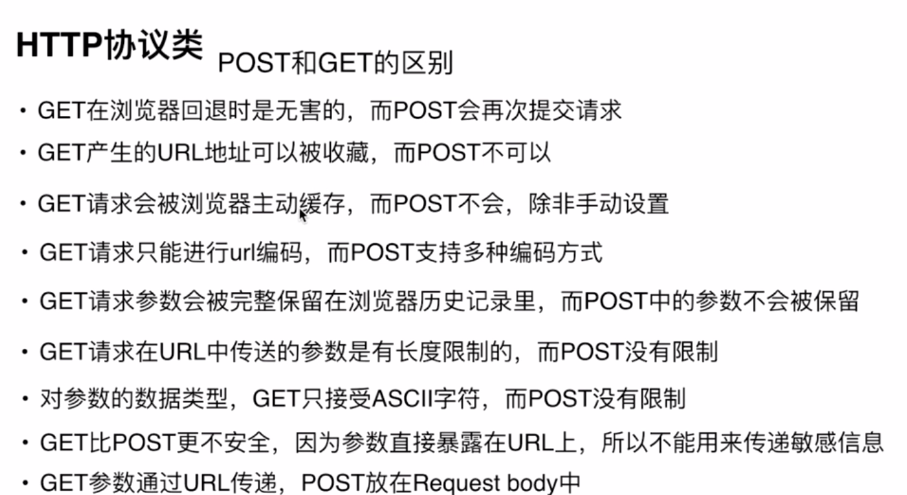

-----> 关于预定义变量，除了$_GET、$_POST,还有很多：

## 预定义变量(超全局变量)
- $_GET：获取所有表单以get方式提交的数据
- $_POST：POST提交的数据都会保存在此
- $_REQUEST：GET和POST提交的都会保存
- $GLOBALS：PHP中所有的全局变量
- $_SERVER：服务器信息 了解即可
- $_ENV：环境信息 了解即可
- $_FILES：用户上传的文件信息 后面会学
- $_SESSION：session会话数据 后面会学
- $_COOKIE：cookie会话数据 后面会学

## POST综合案例

### 下拉菜单相关

#### 下拉菜单提交数据

```php
<!DOCTYPE html>
<html lang="en">
<head>
    <meta charset="UTF-8">
    <meta name="viewport" content="width=device-width, initial-scale=1.0">
    <meta http-equiv="X-UA-Compatible" content="ie=edge">
    <title>Document</title>
</head>
<body>
    <form action="" method="POST">
    最喜欢的车：
        <select name="car">
            <option value="BMW">BMW</option>
            <option value="BENZ">BENZ</option>
            <option value="Fararri">Fararri</option>
            <option value="AUDI">AUDI</option>
            <option value="INFINITI">INFINITI</option>
        </select>
        <input type="submit" value="提交">
    </form>
</body>
</html>
```

#### 下拉菜单数据接收

```php
<?php 
$car = $_POST['car'];
echo $car;
?>
<!DOCTYPE html>
<html lang="en">
<head>
    <meta charset="UTF-8">
    <meta name="viewport" content="width=device-width, initial-scale=1.0">
    <meta http-equiv="X-UA-Compatible" content="ie=edge">
    <title>Document</title>
</head>
<body>
    <form action="" method="POST">
    最喜欢的车：
        <select name="car">
            <option value="BMW">BMW</option>
            <option value="BENZ">BENZ</option>
            <option value="Fararri">Fararri</option>
            <option value="AUDI">AUDI</option>
            <option value="INFINITI">INFINITI</option>
        </select>
        <input type="submit" value="提交">
    </form>
</body>
</html>
```

#### 防止出现警告提示信息

```php
<?php 
if(!empty($_POST)){
    $car = $_POST['car'];
    echo $car;
}
?>
<!DOCTYPE html>
<html lang="en">
<head>
    <meta charset="UTF-8">
    <meta name="viewport" content="width=device-width, initial-scale=1.0">
    <meta http-equiv="X-UA-Compatible" content="ie=edge">
    <title>Document</title>
</head>
<body>
    <form action="" method="POST">
    最喜欢的车：
        <select name="car">
            <option value="BMW">BMW</option>
            <option value="BENZ">BENZ</option>
            <option value="Fararri">Fararri</option>
            <option value="AUDI">AUDI</option>
            <option value="INFINITI">INFINITI</option>
        </select>
        <input type="submit" value="提交">
    </form>
</body>
</html>
```

#### 根据下拉菜单接收的POST数据，对下拉表单设置默认值

```php
<?php 
if(!empty($_POST)){
    $car = $_POST['car'];
    echo $car;
}
?>
<!DOCTYPE html>
<html lang="en">
<head>
    <meta charset="UTF-8">
    <meta name="viewport" content="width=device-width, initial-scale=1.0">
    <meta http-equiv="X-UA-Compatible" content="ie=edge">
    <title>Document</title>
</head>
<body>
    <form action="" method="POST">
    最喜欢的车：
        <select name="car">
            <option value="BMW" <?php if(isset($car) && $car == 'BMW')echo 'selected'?>>BMW</option>
            <option value="BENZ" <?php if(isset($car) && $car == 'BENZ')echo 'selected'?>>BENZ</option>
            <option value="Fararri" <?php if(isset($car) && $car == 'Fararri')echo 'selected'?>>Fararri</option>
            <option value="AUDI" <?php if(isset($car) && $car == 'AUDI')echo 'selected'?>>AUDI</option>
            <option value="INFINITI" <?php if(isset($car) && $car == 'INFINITI')echo 'selected'?>>INFINITI</option>
        </select>
        <input type="submit" value="提交">
    </form>
</body>
</html>
```

### 单选框数据处理

```php
<?php 
print_r($_POST);
if(!empty($_POST)){
    $car = $_POST['car'];
    echo $car;
    $sex = $_POST['sex'];
}
?>
<!DOCTYPE html>
<html lang="en">
<head>
    <meta charset="UTF-8">
    <meta name="viewport" content="width=device-width, initial-scale=1.0">
    <meta http-equiv="X-UA-Compatible" content="ie=edge">
    <title>Document</title>
</head>
<body>
    <form action="" method="POST">
    最喜欢的车：
        <select name="car">
            <option value="BMW" <?php if(isset($car) && $car == 'BMW')echo 'selected'?>>BMW</option>
            <option value="BENZ" <?php if(isset($car) && $car == 'BENZ')echo 'selected'?>>BENZ</option>
            <option value="Fararri" <?php if(isset($car) && $car == 'Fararri')echo 'selected'?>>Fararri</option>
            <option value="AUDI" <?php if(isset($car) && $car == 'AUDI')echo 'selected'?>>AUDI</option>
            <option value="INFINITI" <?php if(isset($car) && $car == 'INFINITI')echo 'selected'?>>INFINITI</option>
        </select>
    性别：
    <input type="radio" name="sex" value="1" <?php if(isset($sex) && $sex =='1' )echo 'checked';?>>男
    <input type="radio" name="sex" value="2" <?php if(isset($sex) && $sex =='2' )echo 'checked';?>>女
        <input type="submit" value="提交">
    </form>
</body>
</html>
```

### 复选框的数据处理

```php
<?php 
header("content-type:text/html;charset=utf8");
if(!empty($_POST)){
	// print_r($_POST);die;
	$car =$_POST['car'];
	$sex =$_POST['sex'];
	$books=$_POST['books'];//数组
	// print_r($books);
	$books =implode(',',$books);//字符串
	echo $car.'---'.$sex.'---'.$books;
}
?>
<!DOCTYPE html>
<html>
<head>
<meta charset="utf-8">
<meta http-equiv="X-UA-Compatible" content="IE=edge,chrome=1">
<title>Examples</title>
<meta name="description" content="">
<meta name="keywords" content="">
<link href="" rel="stylesheet">
</head>
<body>
    <form action="" method="POST">
    	最喜欢的车：
    	<select name="car" id="">
    		<option value="BMW" <?php if(isset($car) && $car == 'BMW' ) echo 'selected'?>>BMW</option>
    		<option value="BENZ" <?php if(isset($car) && $car == 'BENZ' ) echo 'selected'?>>BENZ</option>
    		<option value="Fararri" <?php if(isset($car) && $car == 'Fararri' ) echo 'selected'?>>Fararri</option>
    		<option value="AUDI" <?php if(isset($car) && $car == 'AUDI' ) echo 'selected'?>>AUDI</option>
    		<option value="INFINITI" <?php if(isset($car) && $car == 'INFINITI' ) echo 'selected'?>>INFINITI</option>
    	</select><br />
    	性别：
    	<input type="radio" name="sex" id="" value="1" <?php if(isset($sex) && $sex == 1) echo 'checked'?>>男
    	<input type="radio" name="sex" id="" value="2" <?php if(isset($sex) && $sex == 2) echo 'checked'?>>女
    	<input type="radio" name="sex" id="" value="3" <?php if(isset($sex) && $sex == 3) echo 'checked'?>>中<br />
    	最喜欢的书：
    	<input type="checkbox" name="books[]" id="" value="我是小说家">我是小说家
    	<input type="checkbox" name="books[]" id="" value="岁月留痕">岁月留痕
    	<input type="checkbox" name="books[]" id="" value="白夜行">白夜行
    	<input type="checkbox" name="books[]" id="" value="诗经">诗经<br />
    	<input type="submit" value="提交">
    </form>
</body>
</html>
```

## 学生信息注册(38:00 自己做出来)
传智播客黑马程序员在全国各个小区开设各个专业、诸多班级。现在系统中录入学生，包括学生的学号、姓名，班级，手机号、邮箱等信息。


设计稿如下：

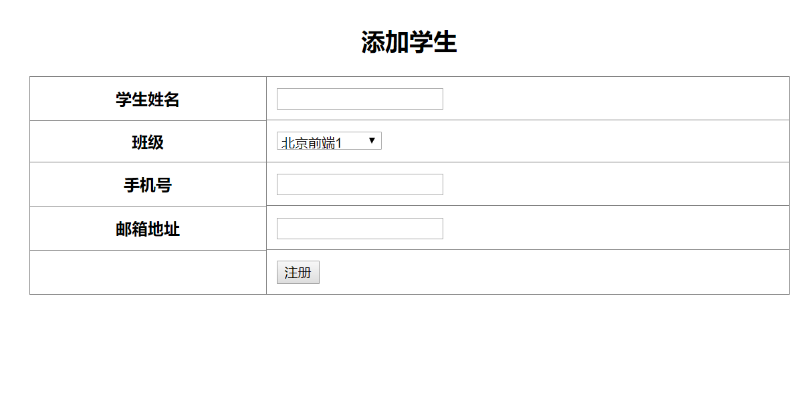

前端工程师提供的静态代码如下：

```html
<!DOCTYPE html>
<html lang="en">
<head>
	<meta charset="UTF-8">
	<title>学生信息注册</title>
</head>
<body>
	<form>
		<table width="60%" align="center" border="1" rules="all" cellpadding="10">
			<caption><h2>添加学生</h2></caption>
			<tr>
				<th>学生姓名</th>
				<td><input type="text" name="name" id=""></td>
			</tr>
			<tr>
				<th>班级</th>
				<td><select name="class_id" id="">
					<option value="1">北京前端1</option>
					<option value="2">上海前端1</option>
					<option value="3">深圳JavaEE1</option>
					<option value="4">北京PHP1</option>
				</select></td>
			</tr>
			<tr>
				<th>手机号</th>
				<td><input type="text" name="tel" id=""></td>
			</tr>
			<tr>
				<th>邮箱地址</th>
				<td><input type="text" name="mail" id=""></td>
			</tr>
			<tr>
				<td></td>
				<td><input type="submit" value="注册"></td>
			</tr>			
		</table>
	</form>
</body>
</html>
```

思考用户操作逻辑：
1. 用户填写好表单
2. 点击提交按钮
3. php获取数据(用POST)
4. 构建插入SQL语句

### 第一步、完善表单html代码

```php
<!DOCTYPE html>
<html lang="en">
<head>
	<meta charset="UTF-8">
	<title>学生信息注册</title>
</head>
<body>
	<form action="./student_add_post.php" method="POST">
		<table width="60%" align="center" border="1" rules="all" cellpadding="10">
			<caption><h2>添加学生</h2></caption>
			<tr>
				<th>学生姓名</th>
				<td><input type="text" name="name" id=""></td>
			</tr>
			<tr>
				<th>班级</th>
				<td><select name="class_id" id="">
					<option value="1">北京前端1</option>
					<option value="2">上海前端1</option>
					<option value="3">深圳JavaEE1</option>
					<option value="4">北京PHP1</option>
				</select></td>
			</tr>
			<tr>
				<th>手机号</th>
				<td><input type="text" name="tel" id=""></td>
			</tr>
			<tr>
				<th>邮箱地址</th>
				<td><input type="text" name="mail" id=""></td>
			</tr>
			<tr>
				<td></td>
				<td><input type="submit" value="注册"></td>
			</tr>			
		</table>
	</form>
</body>
</html>
```


### 第二步、构建接收POST数据的php文件代码(阶段一：大家一起照着做出来)

```php
<?php 
header('content-type:text/html;charset=utf8');
print_r($_POST);
?>
```

### 第三步、创建数据库
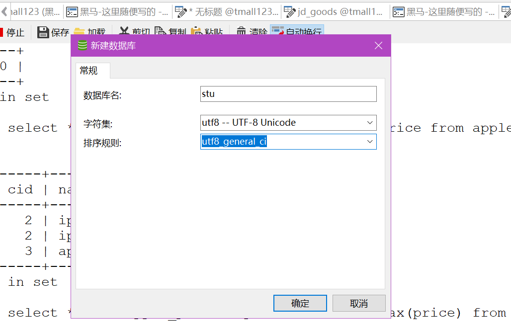

### 第四步、设计表

设计数据库表的原则：
1、默认一张表
2. 一个表单文本框对应一个字段
3. 再添加一个id


```
stu_id 学生id
stu_name 学生名字
class_name 班级名称
tel 电话
mail 邮箱
major 专业
tutor 班主任名称
start_time 开班时间
```

4、当把表设计好之后，看一下哪些字段比较冗余
    + class_name冗余
    + major冗余
    + tutor冗余
    + start_time冗余
5、把冗余的提取出来作为一个新的表 --> 拆表

```
//my_student表
stu_id int primary key auto_increment
stu_name varchar
class_id int
tel char(11)
mail varchar
```

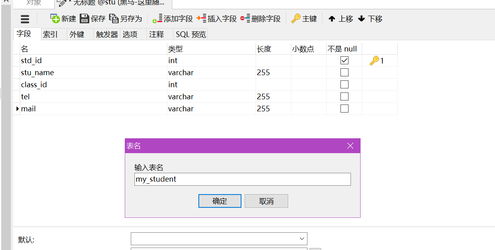

```
//my_class表
class_id int primary key auto_increment
class_name vaarchar
major varchar
tutor varchar
start_time date
```

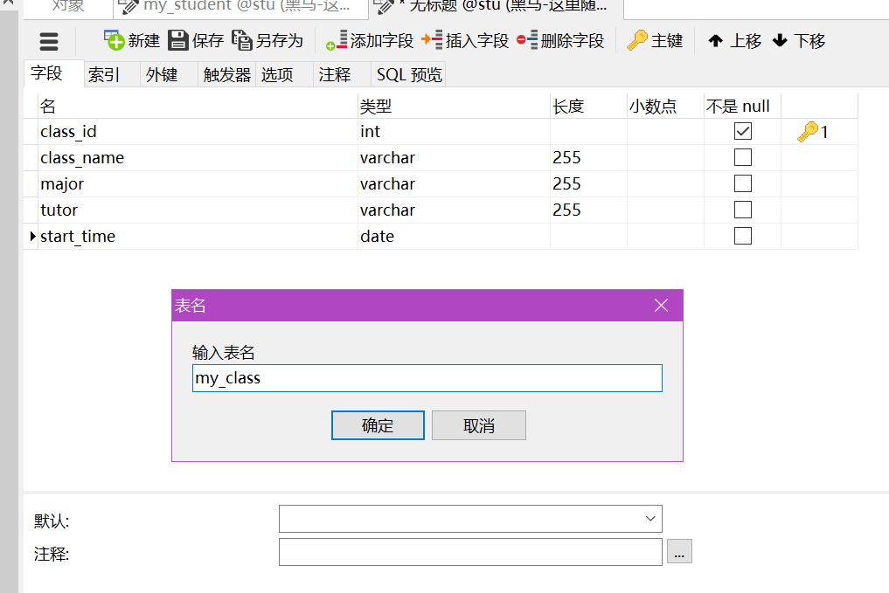

### 第五步、填充假数据

```sql
-- ----------------------------
-- Records of my_class
-- ----------------------------
INSERT INTO `my_class` VALUES ('1', '北京前端1', '前端与移动开发', '赵老师', '2018-04-01');
INSERT INTO `my_class` VALUES ('2', '北京前端2', '前端与移动开发', '李老师', '2018-03-01');
INSERT INTO `my_class` VALUES ('3', '南京java', 'java', '王老师', '2018-03-02');
INSERT INTO `my_class` VALUES ('4', '武汉PHP', 'PHP', '马老师', '2018-02-27');
```

```sql
INSERT INTO `my_student` VALUES ('1', '成同学', '1', '13812345678', 'wefwe@qq.com');
INSERT INTO `my_student` VALUES ('2', '李同学', '2', '13812345678', 'wefw@qq.com');
INSERT INTO `my_student` VALUES ('3', '马同学', '3', '12412345678', 'wfewf@qq.com');
INSERT INTO `my_student` VALUES ('4', '李同学', '3', '234232332', 'wefwefwe@qq.com');
```

### 第六步、根据用户传入的POST数据构建SQL语句

```php
<?php 
header('content-type:text/html;charset=utf8');
// print_r($_POST);
$name = $_POST['name'];
$class_id = $_POST['class_id'];
$tel = $_POST['tel'];
$mail = $_POST['mail'];

$sql ="insert into my_student values (null,'$name',$class_id,'$tel','$mail')";
die($sql);
?>
```

### 第七步、用户名、手机不能为空

```php
<?php 
header('content-type:text/html;charset=utf8');
// print_r($_POST);
$name = $_POST['name'];
$class_id = $_POST['class_id'];
$tel = $_POST['tel'];
$mail = $_POST['mail'];
if(empty($name) || empty($mail)){
    header('refresh:3;url=./5-student-add.php');
   echo "<script>alert('姓名以及手机号不能为空')</script>";
   die();
}
$sql ="insert into my_student values (null,'$name',$class_id,'$tel','$mail')";
die($sql);
?>
```


## 文件上传

### 前端页面设置
- enctype
- method="POST"

### 文件上传接收
- $_FILES
- 文件类型(mime http://www.w3school.com.cn/media/media_mimeref.asp)

```php
$_FILES["file"]["name"] - 被上传文件的名称
$_FILES["file"]["type"] - 被上传文件的类型
//1G = 1024M
//1M = 1024 kb
//1kb = 1024 byte
// 1byte = 8bit
//两个字节相当于一个汉字
//16bit = 1个汉字
$_FILES["file"]["size"] - 被上传文件的大小，以字节计   
$_FILES["file"]["tmp_name"] - 存储在服务器的文件的临时副本的名称
$_FILES["file"]["error"] - 由文件上传导致的错误代码
```

```
错误代码：
值：0; 没有错误发生，文件上传成功。 
值：1; 上传的文件超过了 php.ini 中 upload_max_filesize 选项限制的值。(默认是2M) 
值：2; 上传文件的大小超过了 HTML 表单中 MAX_FILE_SIZE 选项指定的值。 
值：3; 文件只有部分被上传。 
值：4; 没有文件被上传。 
值：5; 上传文件大小为0. 
```

可以通过在form表单中设置<input type="hidden" name="MAX_FILE_SIZE" value="1000">来限定上传的数据大小极限

### 文件上传完整步骤
1. 设计表单
    + enctype值为multipart/form-data
    + method为POST
2. 接收数据$_FILES
3. 通过$_FILES['myFileName']['error']判断出错信息
4. 判断文件是否是HTTP POST上传的文件
    + is_uploaded_file(临时文件路径$_FILES['myFileName']['tmp_name'])
    + 返回true(合法的POST文件)
5. 把文件从tmp临时目录中移动到网站永久路径
    + move_uploaded_file(临时路径$_FILES['myFileName']['tmp_name']永久路径)


### 文件上传实例

```php
// ① 判断上传是否发生严重错误
if(empty($_FILES)){
	die('上传发生严重错误');
}

print_r($_FILES['upload']);
// Array
// (
//     [name] => 404.png
//     [type] => image/png
//     [tmp_name] => C:\Users\julien\AppData\Local\Temp\phpB3BE.tmp
//     [error] => 0
//     [size] => 11504
// )
$file =$_FILES['upload'];

// ②判断错误
if($file['error'] != 0){
	$errorMsg ='';

	switch($file['error']){
		case 1:
			$errorMsg ='超过2M';
			break;
		case 4:
			$errorMsg ='未选择文件';
			break;
		case 6:
			$errorMsg ='临时路径出错';
			break;
		default :
			$errorMsg ='未知错误';
	}

	die("<h4>".$errorMsg."</h4>");

}

// ③判断是否是合法HTTP POST上传文件
if(!is_uploaded_file($file['tmp_name'])){
	die('非法上传文件');
}
// 判断文件大小是否满足要求 1.1M
$maxSize =1.1;
if($maxSize * 1024 * 1024 <  $file['size']){
	die('文件大小超过'.$maxSize.'M');
}

// 判断文件类型是否是支持的类型
// 1、打开finfo资源
$resource  =finfo_open(FILEINFO_MIME_TYPE);
// var_dump($resouce);die;
 // resource(2) of type (file_info) 
 
$mime =finfo_file($resource,$file['tmp_name']);
var_dump($mime);die;
// "image/jpeg" 

// 网站支持的MIME类型
$mimeArr =['image/png','image/jpeg'];
if(!in_array($mime, $mimeArr)){
	die('文件类型不支持');
}

// ④移动临时文件到永久路径
// 永久路径：./upload/a.png
$ext =strrchr($file['name'],'.');
// die($ext);.png
// $savePath ='./upload/'.$file['name'];
$savePath='./upload/'.date('YmdHis-').mt_rand(1000,9999).$ext;
// die($savePath);//./upload/20171012164341-7330.png
// ./upload/404.png

if(move_uploaded_file($file['tmp_name'], $savePath)){
	echo $file['name']."上传成功";
}else{
	echo $file['name']."移动发生错误";
}
```

### 文件上传相关问题
- 万一两个用户上传的文件名字一样怎么办?

## 晚上的任务
- 把sql语句复习一下


# day06
## 引言
- 我们前天做的案例：学生信息添加系统只做了一半，造出一个sql语句之后，接下来是我们人工的去数据库中去操作的，学完今天的东西之后，我们就可以把它完善

## 检测函数是否存在
- function_exists

## php操作数据库步骤

```php
<?php
header('content-type:text/html;charset=utf8');
$link = @mysql_connect('localhost:3306','root','root') or die('数据库忙');
var_dump($link);
?>
```

```php
<?php
header('content-type:text/html;charset=utf8');
$host = 'localhost:3306';
$user = 'root';
$password = 'root';
$link = @mysql_connect($host,$user,$password) or die('数据库忙');
var_dump($link);
?>
```

封装mysql连接

```
<?php
header('content-type:text/html;charset=utf8');
$conf = [];
$conf['host'] = 'localhost:3306';
$conf['user'] = 'root';
$conf['password'] = 'root';
$conf['charset'] = 'utf8';
$conf['db'] = 'fe';

function connect($conf = []){
    $link = @mysql_connect($conf['host'],$conf['user'],$conf['password']) or die('服务器忙');
    //设置字符集
    mysql_query('set names '.$conf['charset']);
    //选择数据库
    mysql_query('use '.$conf['db']) or die('数据库选择失败');
    return $link;//资源型
}

$link = connect($conf);

var_dump($link);
```


mysql_fetch_array,mysql_fetch_row,mysql_fetch_assoc类似于push,pop,每次得到的不一样


## 学生管理系统案例
### 第一步 先看最终的演示效果

### 第二步 提前准备好的静态页面

### 第三步 根据项目需求设计出来数据表
我们发现除了有学生的信息，还有班级的相关的信息，所以，设计两张表

```
my_stu表
- std_id 学生id
- stu_name 学生名称
- class_id 班级id
- tel 电话
- mail 邮箱

my_class表
- class_id 班级id
- class_name 班级名称
- major 专业
- tutor 班主任名称
- start_time 开班时间
```

这里，为了简化项目，直接把现成的sql语句生成项目需要的数据库及表：


```sql
create database itcast_student charset utf8;
use itcast_student;
#包括班级编号，班级名称，学习专业，班主任姓名
create table my_class(
class_id int primary key auto_increment,
class_name varchar(20) not null unique key,
major varchar(20),
tutor varchar(10),
start_time date
);

insert into my_class values 
	(null,'北京前端1','前端与移动开发','赵老师','2017-01-01'),
	(null,'上海前端1','前端与移动开发','王老师','2017-03-01'),
	(null,'深圳JavaEE1','JAVA','宋老师','2017-01-02'),
	(null,'北京PHP1','PHP','吴老师','2017-01-01');

#	录入学生的学号、姓名、年龄、性别，班级、手机号、电子照片等。
create table my_stu(
stu_id int primary key auto_increment,
stu_name varchar(10) not null unique key ,
age tinyint not null default 23,
sex char(2) not null default '保密',
class_id int,
tel char(11),
pics varchar(200)
);

insert into my_stu values 
	(null,'欧阳帅帅',23,'男',1,'13812345678','./upload/1.png'),
	(null,'欧阳娜娜',22,'女',2,'13812345678','./upload/1.png'),
	(null,'欧阳美美',18,'女',3,'13812345678','./upload/1.png'),
	(null,'欧阳斌斌',19,'男',1,'13812345678','./upload/1.png');

```

### 第四步 添加学生信息
1. 在网站根目录中创建一个目录student_demo
2. 把静态文件都拷贝进去
3. 把add.html修改为add.php,index.html修改为index.php,edit.html修改为edit.php,detail.html修改为detail.php
4. 班级名称不能写死，必须来自数据库，所以接下来咱们的任务就是从数据库中取出来所有的班级信息，然后动态渲染到add.php页面上，思路如下
    1. 创建数据库配置
    2. 连接数据库

```php
<?php 
$host = 'localhost:3306';
$user = 'root';
$password = 'root';
$charset = 'utf8';
$db = 'itcast_student';

$link = @mysql_connect($host,$user,$password) or die('数据库连接失败');
//设置编码
mysql_query('set names '.$charset);
//使用数据库
mysql_query('use '.$db);

var_dump($link);
?>
<!DOCTYPE html>
<html lang="en">
<head>
	<meta charset="UTF-8">
	<title>Document</title>
</head>
<body>
	<!-- 录入学生的学号、姓名、年龄、性别，班级、手机号、电子照片等。 -->
	<form >
		<table width="60%" cellpadding="8" border="1" rules="all" align="center">
			<caption><h2>添加学生</h2></caption>
			<tr>
				<th>学生姓名</th>
				<td><input type="text" name="stu_name" id=""></td>
			</tr>
			<tr>
				<th>年龄</th>
				<td><input type="text" name="age" id=""></td>
			</tr>
			<tr>
				<th>性别</th>
				<td>
					<input type="radio" name="sex" id="" value="男">男
					<input type="radio" name="sex" id="" value="女">女
					<input type="radio" name="sex" id="" value="保密" checked >保密
				</td>
			</tr>
			<tr>
				<th>班级</th>
				<td>
                    <select name="class_id" id="">
                        <option value="1">北京前端1</option>
                        <option value="2">上海前端1</option>
                        <option value="3">深圳JavaEE1</option>
                        <option value="4">北京PHP1</option>
					</select></td>
			</tr>
			<tr>
				<th>手机号</th>
				<td>
                    <input type="text" name="tel" id="">
                </td>
			</tr>
			<tr>
				<th>学生照片</th>
				<td>
                    <input type="file" name="up" id="">
                </td>
			</tr>
			<tr>
				<th></th>
				<td>
                    <input type="submit" value="添加">
                </td>
			</tr>
		</table>
	</form>
</body>
</html>	

```

    3. 查询班级数据

```php
<?php 
$host = 'localhost:3306';
$user = 'root';
$password = 'root';
$charset = 'utf8';
$db = 'itcast_student';

$link = @mysql_connect($host,$user,$password) or die('数据库连接失败');
//设置编码
mysql_query('set names '.$charset);
//使用数据库
mysql_query('use '.$db);

// var_dump($link);
$sql = 'select * from my_class';
$results = mysql_query($sql);
// var_dump($results);
// var_dump(mysql_error());
mysql_num_rows($results) > 0 or die('没有查询到数据');
$data = [];
while($row = mysql_fetch_assoc($results)){
	$data[] = $row;
}
print_r($data);
?>
<!DOCTYPE html>
<html lang="en">
<head>
	<meta charset="UTF-8">
	<title>Document</title>
</head>
<body>
	<!-- 录入学生的学号、姓名、年龄、性别，班级、手机号、电子照片等。 -->
	<form >
		<table width="60%" cellpadding="8" border="1" rules="all" align="center">
			<caption><h2>添加学生</h2></caption>
			<tr>
				<th>学生姓名</th>
				<td><input type="text" name="stu_name" id=""></td>
			</tr>
			<tr>
				<th>年龄</th>
				<td><input type="text" name="age" id=""></td>
			</tr>
			<tr>
				<th>性别</th>
				<td>
					<input type="radio" name="sex" id="" value="男">男
					<input type="radio" name="sex" id="" value="女">女
					<input type="radio" name="sex" id="" value="保密" checked >保密
				</td>
			</tr>
			<tr>
				<th>班级</th>
				<td>
                    <select name="class_id" id="">
                        <option value="1">北京前端1</option>
                        <option value="2">上海前端1</option>
                        <option value="3">深圳JavaEE1</option>
                        <option value="4">北京PHP1</option>
					</select></td>
			</tr>
			<tr>
				<th>手机号</th>
				<td>
                    <input type="text" name="tel" id="">
                </td>
			</tr>
			<tr>
				<th>学生照片</th>
				<td>
                    <input type="file" name="up" id="">
                </td>
			</tr>
			<tr>
				<th></th>
				<td>
                    <input type="submit" value="添加">
                </td>
			</tr>
		</table>
	</form>
</body>
</html>	

```

    4. 进行php渲染


```php
<?php 
$host = 'localhost:3306';
$user = 'root';
$password = 'root';
$charset = 'utf8';
$db = 'itcast_student';

$link = @mysql_connect($host,$user,$password) or die('数据库连接失败');
//设置编码
mysql_query('set names '.$charset);
//使用数据库
mysql_query('use '.$db);

// var_dump($link);
$sql = 'select * from my_class';
$results = mysql_query($sql);
// var_dump($results);
// var_dump(mysql_error());
mysql_num_rows($results) > 0 or die('没有查询到数据');
$data = [];
while($row = mysql_fetch_assoc($results)){
	$data[] = $row;
}
print_r($data);
?>
<!DOCTYPE html>
<html lang="en">
<head>
	<meta charset="UTF-8">
	<title>Document</title>
</head>
<body>
	<!-- 录入学生的学号、姓名、年龄、性别，班级、手机号、电子照片等。 -->
	<form >
		<table width="60%" cellpadding="8" border="1" rules="all" align="center">
			<caption><h2>添加学生</h2></caption>
			<tr>
				<th>学生姓名</th>
				<td><input type="text" name="stu_name" id=""></td>
			</tr>
			<tr>
				<th>年龄</th>
				<td><input type="text" name="age" id=""></td>
			</tr>
			<tr>
				<th>性别</th>
				<td>
					<input type="radio" name="sex" id="" value="男">男
					<input type="radio" name="sex" id="" value="女">女
					<input type="radio" name="sex" id="" value="保密" checked >保密
				</td>
			</tr>
			<tr>
				<th>班级</th>
				<td>
                    <select name="class_id" id="">
						<?php for($i=0;$i<count($data);$i++){?>						
                        	<option value="<?php echo $data[$i]['class_id']?>"><?php echo $data[$i]['class_name'] ?></option>
						<?php } ?>
					</select></td>
			</tr>
			<tr>
				<th>手机号</th>
				<td>
                    <input type="text" name="tel" id="">
                </td>
			</tr>
			<tr>
				<th>学生照片</th>
				<td>
                    <input type="file" name="up" id="">
                </td>
			</tr>
			<tr>
				<th></th>
				<td>
                    <input type="submit" value="添加">
                </td>
			</tr>
		</table>
	</form>
</body>
</html>	

```

    5. 把数据库连接相关的代码提取到公共文件connect.php

```php
//add.php
<?php 
include "./connect.php";
// var_dump($link);
$sql = 'select * from my_class';
$results = mysql_query($sql);
// var_dump($results);
// var_dump(mysql_error());
mysql_num_rows($results) > 0 or die('没有查询到数据');
$data = [];
while($row = mysql_fetch_assoc($results)){
	$data[] = $row;
}
// print_r($data);
?>
<!DOCTYPE html>
<html lang="en">
<head>
	<meta charset="UTF-8">
	<title>Document</title>
</head>
<body>
	<!-- 录入学生的学号、姓名、年龄、性别，班级、手机号、电子照片等。 -->
	<form >
		<table width="60%" cellpadding="8" border="1" rules="all" align="center">
			<caption><h2>添加学生</h2></caption>
			<tr>
				<th>学生姓名</th>
				<td><input type="text" name="stu_name" id=""></td>
			</tr>
			<tr>
				<th>年龄</th>
				<td><input type="text" name="age" id=""></td>
			</tr>
			<tr>
				<th>性别</th>
				<td>
					<input type="radio" name="sex" id="" value="男">男
					<input type="radio" name="sex" id="" value="女">女
					<input type="radio" name="sex" id="" value="保密" checked >保密
				</td>
			</tr>
			<tr>
				<th>班级</th>
				<td>
                    <select name="class_id" id="">
						<?php for($i=0;$i<count($data);$i++){?>						
                        	<option value="<?php echo $data[$i]['class_id']?>"><?php echo $data[$i]['class_name'] ?></option>
						<?php } ?>
					</select></td>
			</tr>
			<tr>
				<th>手机号</th>
				<td>
                    <input type="text" name="tel" id="">
                </td>
			</tr>
			<tr>
				<th>学生照片</th>
				<td>
                    <input type="file" name="up" id="">
                </td>
			</tr>
			<tr>
				<th></th>
				<td>
                    <input type="submit" value="添加">
                </td>
			</tr>
		</table>
	</form>
</body>
</html>	

```


```php
//connect.php
<?php 
$host = 'localhost:3306';
$user = 'root';
$password = 'root';
$charset = 'utf8';
$db = 'itcast_student';

$link = @mysql_connect($host,$user,$password) or die('数据库连接失败');
//设置编码
mysql_query('set names '.$charset);
//使用数据库
mysql_query('use '.$db);
?>
```

    6. 修改form表单

```html
<form action="./insert.php" method="POST" enctype="multipart/form-data">
```

    7. 创建insert.php,接收用户POST的数据

```php
//insert.php
<?php 
header('content-type:text/html;charset=utf8');
print_r($_POST);
?>
```

    8. 处理文件上传

```php
<?php 
header('content-type:text/html;charset=utf8');
print_r($_POST);
// print_r($_FILES);
if(empty($_FILES)){
    die('非法登录');
}
$file = $_FILES['upload'];
//1. 判断文件上传是否有错误
if($file['error'] !=0){
    $errMsg = '';
    switch($file['error']){
        case 1:
            $errMsg = '超过2M';
            break;
        case 4:
            $errMsg = '未选择的文件';
            break;
        case 6:
            $errMsg = '临时路径出错';
            break;
        default:
            $errMsg = '未知错误';
    }

    die($errMsg);
}

//2. 判断是否是合法HTTP POST上传文件
if(!is_uploaded_file($file['tmp_name'])){
    die('非法上传文件');
}

//3. 判断文件大小是否满足要求1.1M
$maxSize = 1.1;
if($maxSize * 1024 * 1024 < $file['size']){
    die('文件大小超过'.$maxSize.'M');
}

//判断文件类型是否支持的类型
//1. 打开finfo资源
$resource = finfo_open(FILEINFO_MIME_TYPE);
$mime = finfo_file($resource,$file['tmp_name']);
// var_dump($mime);
// die();

//网站支持的MIME类型
$mimeArr = ['image/png','image/jpeg'];
if(!in_array($mime,$mimeArr)){
    die('文件类型不支持');
}

//移动临时文件到永久路径
//永久路径 ./upload 
$ext = strrchr($file['name'],'.');
$savePath = './upload/'.date('YmdHis-').mt_rand(1000,9999).$ext;
// echo $savePath;

if(move_uploaded_file($file['tmp_name'],$savePath)){
    echo $file['name'].'上传成功';
}else{
    echo $file['name'].'移动发生错误';
}
```

    9. 把提交的数据插入到数据库当中
	10. 跳转到首页

```php
<?php 
header('content-type:text/html;charset=utf8');
include './connect.php';
// print_r($_POST);
// print_r($_FILES);
$file = $_FILES['upload'];
//1. 判断文件上传是否有错误
if($file['error'] !=0){
    $errMsg = '';
    switch($file['error']){
        case 1:
            $errMsg = '超过2M';
            break;
        case 4:
            $errMsg = '未选择的文件';
            break;
        case 6:
            $errMsg = '临时路径出错';
            break;
        default:
            $errMsg = '未知错误';
    }

    die($errMsg);
}

//2. 判断是否是合法HTTP POST上传文件
if(!is_uploaded_file($file['tmp_name'])){
    die('非法上传文件');
}

//3. 判断文件大小是否满足要求1.1M
$maxSize = 1.1;
if($maxSize * 1024 * 1024 < $file['size']){
    die('文件大小超过'.$maxSize.'M');
}

//判断文件类型是否支持的类型
//1. 打开finfo资源
$resource = finfo_open(FILEINFO_MIME_TYPE);
$mime = finfo_file($resource,$file['tmp_name']);
// var_dump($mime);
// die();

//网站支持的MIME类型
$mimeArr = ['image/png','image/jpeg'];
if(!in_array($mime,$mimeArr)){
    die('文件类型不支持');
}

//移动临时文件到永久路径
//永久路径 ./upload 
$ext = strrchr($file['name'],'.');
$savePath = './upload/'.date('YmdHis-').mt_rand(1000,9999).$ext;
// echo $savePath;

if(move_uploaded_file($file['tmp_name'],$savePath)){
    // echo $file['name'].'上传成功';
    //开始构建插入SQL语句
    $stu_name = $_POST['stu_name'];
    $age = $_POST['age'];
    $sex = $_POST['sex'];
    $class_id = $_POST['class_id'];
    $tel = $_POST['tel'];
    $sql = "insert into my_stu (stu_name,age,sex,class_id,tel,pics) values('$stu_name',$age,'$sex',$class_id,'$tel','$savePath');";
    // echo '<br>';
    echo $sql;
    $result = mysql_query($sql);
    var_dump($result);
    if($result){
        //成功
        header('refresh:1;url=./index.php');
    }else{
        //失败
        echo '<script>alert("插入失败");history.go(-1);</script>';
    }
}else{
    echo $file['name'].'移动发生错误';
}
```

### 第五步 展示学生列表
1. 连接数据库
2. 查询学生列表数据

```php
<?php 
include './connect.php';
$sql = 'select * from my_stu';
$results = mysql_query($sql);
// var_dump(mysql_num_rows($results));
mysql_num_rows($results) > 0 or die('暂无数据');
$data = [];
while($row = mysql_fetch_assoc($results)){
	$data[] = $row;
}
// print_r($data);
?>
<!DOCTYPE html>
<html lang="en">
<head>
	<meta charset="UTF-8">
	<title>首页</title>
</head>
<body>
	<table width="50%" border="1" rules="all" cellpadding="8" align="center">
		<caption><h2>学生列表</h2></caption>
		<tr>
			<td>学号</td>
			<td>姓名</td>
			<td>手机号</td>
			<td>操作</td>
		</tr>
		<tr>
			<td>1</td>
			<td><a href="#">欧阳帅帅</a></td>
			<td>13812345678</td>
			<td><a href="#">修改</a> || 删除</td>
		</tr>
		<tr>
			<td>1</td>
			<td><a href="#">欧阳帅帅</a></td>
			<td>13812345678</td>
			<td><a href="#">修改</a> || 删除</td>
        </tr>
        <tr>
			<td>1</td>
			<td><a href="#">欧阳帅帅</a></td>
			<td>13812345678</td>
			<td><a href="#">修改</a> || 删除</td>
        </tr>
        <tr>
			<td>1</td>
			<td><a href="#">欧阳帅帅</a></td>
			<td>13812345678</td>
			<td><a href="#">修改</a> || 删除</td>
		</tr>
	</table>
</body>
</html>
```

3. 渲染

```php
<?php 
include './connect.php';
$sql = 'select * from my_stu';
$results = mysql_query($sql);
// var_dump(mysql_num_rows($results));
mysql_num_rows($results) > 0 or die('暂无数据');
$data = [];
while($row = mysql_fetch_assoc($results)){
	$data[] = $row;
}
// print_r($data);
?>
<!DOCTYPE html>
<html lang="en">
<head>
	<meta charset="UTF-8">
	<title>首页</title>
</head>
<body>
	<table width="50%" border="1" rules="all" cellpadding="8" align="center">
		<caption><h2>学生列表</h2></caption>
		<tr>
			<td>学号</td>
			<td>姓名</td>
			<td>手机号</td>
			<td>操作</td>
		</tr>
		<?php for($i=0;$i<count($data);$i++){ ?> 
		<tr>
			<td><?php echo $data[$i]['stu_id'] ?></td>
			<td><a href="#"><?php echo $data[$i]['stu_name'] ?></a></td>
			<td><?php echo $data[$i]['tel'] ?></td>
			<td><a href="#">修改</a> || 删除</td>
		</tr>
		<?php } ?>
	</table>
</body>
</html>
```

### 第六步 修改学生信息
- 修改其实和添加的逻辑有点类似，所以，我们直接拷贝添加的php代码过来

```php

<?php 
include "./connect.php";
// var_dump($link);
$sql = 'select * from my_class';
$results = mysql_query($sql);
// var_dump($results);
// var_dump(mysql_error());
mysql_num_rows($results) > 0 or die('没有查询到数据');
$data = [];
while($row = mysql_fetch_assoc($results)){
	$data[] = $row;
}
// print_r($data);
?>
<!DOCTYPE html>
<html lang="en">
<head>
	<meta charset="UTF-8">
	<title>Document</title>
</head>
<body>
	<!-- 录入学生的学号、姓名、年龄、性别，班级、手机号、电子照片等。 -->
	<form action="update.php?stu_id=1" method="POST" enctype="multipart/form-data">
		<!-- <input type="hidden" name="stu_id" value="1"> -->
		<table width="60%" cellpadding="8" border="1" rules="all" align="center">
			<caption><h2>修改学生信息</h2></caption>
			<tr>
				<th>学生姓名</th>
				<td><input type="text" name="stu_name" id="" value="欧阳帅帅"></td>
			</tr>
			<tr>
				<th>年龄</th>
				<td><input type="text" name="age" id="" value="23"></td>
			</tr>
			<tr>
				<th>性别</th>
				<td>
					<input type="radio" name="sex" id="" value="男" checked>男
					<input type="radio" name="sex" id="" value="女" >女
					<input type="radio" name="sex" id="" value="保密" >保密
				</td>
			</tr>
			<tr>
				<th>班级</th>
				<td>
                    <select name="class_id" id="">
						<?php for($i=0;$i<count($data);$i++){?>						
                        	<option value="<?php echo $data[$i]['class_id']?>"><?php echo $data[$i]['class_name'] ?></option>
						<?php } ?>
					</select></td>
			</tr>
			<tr>
				<th>手机号</th>
				<td><input type="text" name="tel" id="" value="13812345678"></td>
			</tr>
			<tr>
				<th></th>
				<td><input type="submit" value="修改"></td>
			</tr>
		</table>
	</form>
</body>
</html>	


```


- 思考
用户操作逻辑：点击修改链接跳转到修改页面，进一步思考：为什么不同的修改可以知道要修改哪一个？ --> 通过id

```php
	<td><a href="./edit.php?stu_id=<?php echo $data[$i]['stu_id'] ?>">修改</a> || 删除</td>
```

add.php要做的事情是获取当前的id,然后去数据库当中查询到对应的数据

```php

<?php 
include "./connect.php";
// var_dump($link);
$sql = 'select * from my_class';
$results = mysql_query($sql);
// var_dump($results);
// var_dump(mysql_error());
mysql_num_rows($results) > 0 or die('没有查询到数据');
$data = [];
while($row = mysql_fetch_assoc($results)){
	$data[] = $row;
}
// print_r($data);

// print_r($_GET);
if(!empty($_GET)){
	$stu_id = $_GET['stu_id'];
}else{
	$stu_id = 1;
}
// echo $stu_id;
$sql1 = 'select * from my_stu where stu_id='.$stu_id;
$results1 = mysql_query($sql1);
mysql_num_rows($results1) > 0 or die('暂无数据');
$data1 = mysql_fetch_assoc($results1);
print_r($data1);
?>
<!DOCTYPE html>
<html lang="en">
<head>
	<meta charset="UTF-8">
	<title>Document</title>
</head>
<body>
	<!-- 录入学生的学号、姓名、年龄、性别，班级、手机号、电子照片等。 -->
	<form action="" method="POST" enctype="multipart/form-data">
		<table width="60%" cellpadding="8" border="1" rules="all" align="center">
			<caption><h2>修改学生信息</h2></caption>
			<tr>
				<th>学生姓名</th>
				<td><input type="text" name="stu_name" id="" value="欧阳帅帅"></td>
			</tr>
			<tr>
				<th>年龄</th>
				<td><input type="text" name="age" id="" value="23"></td>
			</tr>
			<tr>
				<th>性别</th>
				<td>
					<input type="radio" name="sex" id="" value="男" checked>男
					<input type="radio" name="sex" id="" value="女" >女
					<input type="radio" name="sex" id="" value="保密" >保密
				</td>
			</tr>
			<tr>
				<th>班级</th>
				<td>
                    <select name="class_id" id="">
						<?php for($i=0;$i<count($data);$i++){?>						
                        	<option value="<?php echo $data[$i]['class_id']?>"><?php echo $data[$i]['class_name'] ?></option>
						<?php } ?>
					</select></td>
			</tr>
			<tr>
				<th>手机号</th>
				<td><input type="text" name="tel" id="" value="13812345678"></td>
			</tr>
			<tr>
				<th></th>
				<td><input type="submit" value="修改"></td>
			</tr>
		</table>
	</form>
</body>
</html>	

```

接下来去渲染到页面当中

```php

<?php 
include "./connect.php";
// var_dump($link);
$sql = 'select * from my_class';
$results = mysql_query($sql);
// var_dump($results);
// var_dump(mysql_error());
mysql_num_rows($results) > 0 or die('没有查询到数据');
$data = [];
while($row = mysql_fetch_assoc($results)){
	$data[] = $row;
}
// print_r($data);

// print_r($_GET);
if(!empty($_GET)){
	$stu_id = $_GET['stu_id'];
}else{
	$stu_id = 1;
}
// echo $stu_id;
$sql1 = 'select * from my_stu where stu_id='.$stu_id;
$results1 = mysql_query($sql1);
mysql_num_rows($results1) > 0 or die('暂无数据');
$data1 = mysql_fetch_assoc($results1);
print_r($data1);
?>
<!DOCTYPE html>
<html lang="en">
<head>
	<meta charset="UTF-8">
	<title>Document</title>
</head>
<body>
	<!-- 录入学生的学号、姓名、年龄、性别，班级、手机号、电子照片等。 -->
	<form action="" method="POST" enctype="multipart/form-data">
		<table width="60%" cellpadding="8" border="1" rules="all" align="center">
			<caption><h2>修改学生信息</h2></caption>
			<tr>
				<th>学生姓名</th>
				<td><input type="text" name="stu_name" id="" value="<?php echo $data1['stu_name'];?>"></td>
			</tr>
			<tr>
				<th>年龄</th>
				<td><input type="text" name="age" id="" value="<?php echo $data1['age'];?>"></td>
			</tr>
			<tr>
				<th>性别</th>
				<td>
					<input type="radio" name="sex" id="" value="男" <?php echo $data1['sex']=='男'?'checked':'';?>>男
					<input type="radio" name="sex" id="" value="女" <?php echo $data1['sex']=='女'?'checked':'';?>>女
					<input type="radio" name="sex" id="" value="保密" <?php echo $data1['sex']=='保密'?'checked':'';?>>保密
				</td>
			</tr>
			<tr>
				<th>班级</th>
				<td>
                    <select name="class_id" id="">
						<?php for($i=0;$i<count($data);$i++){?>						
                        	<option value="<?php echo $data[$i]['class_id']?>" <?php echo $data1['class_id']==$data[$i]['class_id']?'selected':'';?>><?php echo $data[$i]['class_name'] ?></option>
						<?php } ?>
					</select></td>
			</tr>
			<tr>
				<th>手机号</th>
				<td><input type="text" name="tel" id="" value="<?php echo $data1['tel'];?>"></td>
			</tr>
			<tr>
				<th></th>
				<td><input type="submit" value="修改"></td>
			</tr>
		</table>
	</form>
</body>
</html>	
```

接下来，处理用户修改提交的数据，添加update.php

```php
//edit.php

<?php 
include "./connect.php";
// var_dump($link);
$sql = 'select * from my_class';
$results = mysql_query($sql);
// var_dump($results);
// var_dump(mysql_error());
mysql_num_rows($results) > 0 or die('没有查询到数据');
$data = [];
while($row = mysql_fetch_assoc($results)){
	$data[] = $row;
}
// print_r($data);

// print_r($_GET);
if(!empty($_GET)){
	$stu_id = $_GET['stu_id'];
}else{
	$stu_id = 1;
}
// echo $stu_id;
$sql1 = 'select * from my_stu where stu_id='.$stu_id;
$results1 = mysql_query($sql1);
mysql_num_rows($results1) > 0 or die('暂�