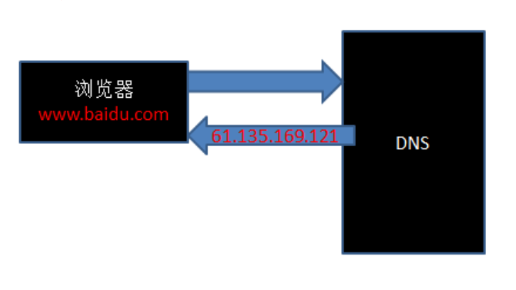
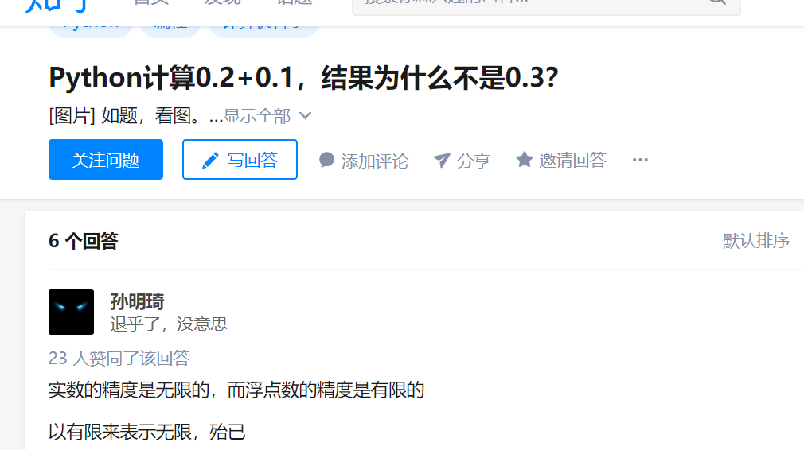

## php是用来做什么的(15:03)
- php是用来做后台的(服务器端语言)

## web基本概念(web服务器、软件架构、ip地址、域名)(15:33)
- 静态资源与动态资源
- 服务器端与客户端(浏览器端)
- ip地址与域名
    + 如果我们想算圆的面积，可能用得到3.14159....,但是我们没有人记得住，所以，我们会这样做：var pi = 3.14159..,这样定义好之后，下次，我们直接用pi这个变量即可
    + 域名也类似一个变量，我们买了域名，然后让域名和我们的ip地址关联好之后，以后，直接可以通过域名进行访问
    + ping
    + ipconfig
    + 127.0.0.1
    + 192.168开头为当前局域网的地址

## web基本概念(dns、端口)(11:25)
- dns的作用



- hosts修改
    + 尝试访问itcast.net
    + 在hosts中添加一行：127.0.0.1 itcast.net，再次访问itcast.net查看效果
- 理解：
    + 实际上找到一台电脑用的是ip地址
    + ip地址太难记了，所以需要让ip地址对应一个域名，因为域名更好记
    + 输入的虽然是域名，但是在找服务器之前，会先通过dns,hosts之类的找到对应的ip是多少
- 端口
    + 通过商场的例子来理解端口
## web基本概念(url、web程序的访问流程)(6:39)
- url的组成
- web程序的访问流程
    + 静态：请求 ---> 找到对应的静态资源 --> 响应
    + 动态：请求 ---> php从数据库中找到对应的数据 --> 与对应的模板组成最终的页面 --> 响应

## phpStudy安装(不放)
    + 东八区的配置(不设置的话，会有警告提示信息，同时时间会差8小时)
        1. 其他选项 --> 打开配置文件 --> php.ini --> date.timezone = PRC --> 重启
```php
echo date('Y-m-d H:i:s');
```
    + 切记：修改任何配置项，一定要重启服务器软件

## 配置虚拟主机
1. 其他选项 --> 打开配置文件 --> httpd.conf --> LoadModule vhost_alias_module modules/mod_vhost_alias.so前面的#号去掉
2. 其他选项 --> 站点域名管理 --> 新增 --> 保存
    + 练习
        1. www.ali.com
        2. www.test.com
        3. oa.test.com
3. hosts文件添加对应的域名和ip(127.0.0.1)的映射

4. 在vhosts.ini中添加如下两行

```
<VirtualHost *:80>
    DocumentRoot "C:\Users\zhengwei\Desktop\server\www.ali.com"
    ServerName www.ali.com
    ServerAlias ali.com
  <Directory "C:\Users\zhengwei\Desktop\server\www.ali.com">
+      Options indexes FollowSymLinks ExecCGI
+      DirectoryIndex index.html index.php
      AllowOverride All
      Order allow,deny
      Allow from all
     Require all granted
  </Directory>
</VirtualHost>

```
5. 重启服务器

## php基本语法(开始结束标记、注释)(8:52)
- 文件名、文件夹名一定不能是中文，否则会出问题(可以演示一下)
- php与html混写(开始结束必须都要有)
- 纯粹php代码(结束可以不写)
- 注释和js方式一样(以#号这种平时基本上没有人用的)

```php
<?php --> 代表接下来属于php的世界
//php代码写在这里
?> --> 代表php代码结束了
```

## 变量基本操作(变量命名规则、命名规范、unset)(19:50)
- 命名规则
    1. 必须是以$开头
    2. 必须只能是由数字、字母、下划线组成
    3. 开头不能是数字
    4. 区分大小写
- 命名规范
    + 小驼峰 $studentName = 'jack'
    + 大驼峰 $StudentName = 18
    + 下划线命名法 $student_sex = 1
- unset

```php
<?php
$a = 1;//声明和赋值$a这个变量
echo $a;
$a = 2;//在修改$a变量的值
echo $a;
?>
```

```php
<?php 
$a = 100;
echo $a;
unset($a);
echo $a;
?>
```

## 变量输出以及类型获取(23:15)
- echo(用得最多，类似console.log)
    + echo true;结果是1
    + echo false;结果是空
- print(和echo作用一样，用得不多)
- print_r(用来打印数组)
- var_dump(类似typeof,可以打印值和类型)

## php变量类型及整型(21:09)
### 变量类型
- 整型
- 浮点型
- 布尔型(不区分大小写)
- 字符串
- null(不区分大小写)
- 资源类型
    + 把数据库连接代码抄写一遍，提前熟悉一下整个过程

```php
$host = 'localhost';//数据库服务器主机名
$user = 'root';//数据库服务器用户名
$password = 'root';//密码
//与数据库建立连接，成功返回资源类型数据，失败返回FALSE,类似和别人聊天先要打电话把电话打通建立连接
$link = mysql_connect($host,$user,$password); 
var_dump($link);   
```

### 什么情况下值为null
- 通过变量赋值明确指定为变量的值为NULL
- 一个变量没有给任何值
- 使用函数unset()将变量销毁掉

## 浮点型、布尔型(18:31)
- 浮点型就是小数类型，一般用float,double表示
- 浮点型在运算的时候有可能出现精度的问题，导致如果进行比较的时候有问题，这块了解即可(0.2 + 0.4 ---> 0.60000000001)
    + 参考网站：http://0.30000000000000004.com
- 因为随着测量和数据的需要，我们需要更加精密的描述，如开根号2。在数学中，我们叫科学计数法。计算机中同类型的东西被称为浮点型。记住，它的存在意义和价值是计算的精度，双精度比单精度更精密，但同时更耗空间
- isset:变量未赋值或者值为null,返回为false,其他返回为true
- empty:判断变量是否为空，"",0,'0',0.0,NULL,false,[]时，为true




```php
<?php 
header('content-type:text/html;charset=utf8');
$a = "";
var_dump(empty($a));
echo '<br>';
$b = 0;
var_dump(empty($b));
echo '<br>';
$c = 0.0;
var_dump(empty($c));
echo '<br>';
$d = NULL;
var_dump(empty($d));
echo '<br>';
$e = false;
var_dump(empty($e));
echo '<br>';
$f = [];
var_dump(empty($f));
?>
```

## 练习
1、说一说哪些变量是合法的
a)$1a
b)$a
c)$a1
d)$-a
e)$a100
2、什么是静态网站、什么是动态网站?
3、dns怎么理解?
4、url的格式是怎么样的?
5、变量的类型有哪些?
6、自己再配置两个虚拟主机：www.test.com oa.test.com(后面的课程用得上)

## 课程反馈

## 练习参考答案
1、$a,$a1,$a100
2、参考讲义
3、参考讲义
4、参考讲义
5、参考讲义
6、参考讲义
