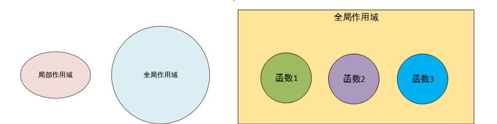
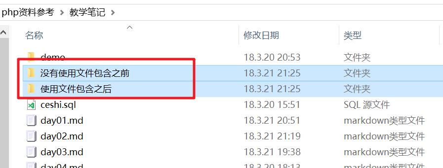

## 类型自动转换与强制类型转(14:39)

### 注意事项
- 在php中+号就是加号并没有拼接的功能

### 隐式类型转换
- 任何变量类型进行加减乘除操作，都会转换成数字类型

```php
echo 0+'aaa12345';//不是以数字开头的，转换成0
echo '<br>';
echo '<br>';
echo 1 + 'abc';
echo 0+'123aaa';//以数字开头的，截取前面的作为数字
echo '<br>';
echo 1 + '5.53string';
echo '<br>';
echo 5 + '-4string';
echo '<br>';
echo 1 + true;//true转换成1
echo '<br>';
echo 1 + false;//false转换成0
echo '<br>';
echo 1.5 + true;
echo '<br>';
echo 1 + null;//null转换成0
echo '<br>';

```

### 强制类型转换

```php
var_dump((int)('aaa12345'));
echo '<br>';
var_dump((int)('123aaa'));
echo '<br>';
var_dump((int)('5.53string'));
echo '<br>';
var_dump((float)('5.53string'));
echo '<br>';
var_dump((int)(true));
echo '<br>';
var_dump((int)(false));
echo '<br>';
var_dump((int)(null));
```
a)转换为false的情况：
- 整型0
- 浮点型0.0
- 字符串’0’
- 空字符串 ‘’
- null
- 空数组

```php
<?php 
header('content-type:text/html;charset=utf8;');
if(!null){
    echo 'null是false';
}
echo '<br>';
if(![]){
    echo '[]是false';
}
echo '<br>';
if(!''){
    echo "''是false";
}
echo '<br>';
if(!0){
    echo '0是false';
}
echo '<br>';
if(!0.0){
    echo '0.0是false';
}
```

## define、const及defined函数(12:49)
- 常量不是$开头
- 推荐常量用大写

```php
define('PI',3.14159);
echo PI;
echo '<br>';
const PI1 = 3.14159;
echo PI1;
echo '<br>';
var_dump(defined('PI'));
```

## 运算符(13:27)
- 错误抑制符
    + 可以用来抑制warnning、notice级别的错误

```php
$a = 8;
$b = 0;
echo @($a / $b);
```

- 拼接运算符

## 条件判断(21:05) - 不放
- js中的if...else if...在php中变成了if...elseif...
- &&作用和and作用是一样的 
- ||与or作用是一样的

```php
var_dump(true || false);
echo '<br>';
var_dump(true or false);
echo '<br>';
var_dump(true && false);
echo '<br>';
var_dump(true and false);
```

- !代表非的意思

- die函数的作用 - 中止代码继续往后操作(了解：还有一个和它一样的叫exit）

```
$a = mysql_query("use ".$conf['db']);
if(!$a == true){
    die('数据库连接失败');
}
```

- 上面写法太麻烦了，可以利用php的or的特点(如果前面是true,后面半句不会执行) ---> 短路机制

```php
mysql_query('use '.$conf['db']) or die('数据库连接失败');
```

简写如下代码：

```php
if(!defined('PI')){
    define('PI',3.14159);
}
```

```php
//短路运算：如果前面的值是true,则后面的表达式不执行，相当于被抛弃
//如果前面的是false,则后面的表达式执行
defined('PI') or define('PI',3.14159);
```

容易犯错的地方：

```php
$a = 200 || 300;
echo $a;//结果是1，分析：200||300就是true||true,结果是true --> 打印true结果是1
```

```php
$a = 200 or 300;
echo $a;//大家思考结果是多少?
```

如何理解：http://php.net/manual/zh/language.operators.preced

## 循环 - 不放
- sleep()

```php
$a = 100;
sleep(5);
echo $a;
```

## 函数基础语法(23:09)(不放)
- 优秀的程序员哪怕是设计一个炸毁火星的函数，肯定不是直接写一个function,而是设计一个参数，然后把火星当参数传进去

- 参数默认值

```php
function add($a,$b){
    return $a + $b;
}
echo add(2,3);
```

如果用户传入的参数个数不够，会有警告信息

```php
function add($a,$b){
    return $a + $b;
}
echo add(2);
```

解决办法：参数默认值

```php
function add($a=0,$b=0){
    return $a + $b;
}
echo add(2);
```

## 作用域(20:00)
- 全局变量(函数外定义的变量)
- 函数内部变量
- 函数内部不能访问函数外面的变量
- 超全局变量$GLOBALS
    1. 创建的全局变量，系统会自动在$GLOBALS中创建变量名为下标的元素
    2. 在$GLOBALS中添加元素，自动创建相应名字的全局变量
    3. 删除或者修改$GLOBALS数组的元素，会导致全局变量同步修改或删除



## 系统函数(16:41)

### 数字相关

```php
header('content-type:text/html;charset=utf8;');
echo max(4,1,3);
echo '<br>';
echo min(4,1,3);
echo '<br>';
echo round(5.5);
echo '<br>';
echo ceil(5.5);
echo '<br>';
echo floor(5.5);
echo '<br>';
echo rand(1,100);
echo '<br>';
echo mt_rand(1,100);//mt_rand()是更好地随机数生成器，因为它跟rand()相比播下了一个更好地随机数种子；而且性能上比rand()快4倍，mt_getrandmax()所表示的数值范围也更大
```


- max 类似js中的Math.max
- min 类似js中的Math.min
- abs 类似js中的Math.abs
- floor 类似js中的Math.floor
- ceil 类似js中的Math.ceil
- round 类似js中的Math.round
- rand和mt_rand(区别：mt_rand性能更快) 类似js中的Math.random

### 日期相关

```php
header('content-type:text/html;charset=utf8;');
echo date('Y-m-d H:i:s');// 相当于js中的(new Date()).toString() Y-m-d H:i:s ---> 年-月-日 时:分:秒 参考：http://www.php.net/manual/zh/function.date.php 通过手册上的说明，大家可以明白为什么Y,H必须要是大写的
echo '<br>';
echo date('Y年m月d日 H时i分s秒');
echo '<br>';
echo '时间戳'.time();//和js的区别：js的时间戳（Date.now()）位数是14位，单位是微秒，php的时间戳单位是秒
echo '<br>;
echo strtotime('+1 day);//1521724548,(new Date(1521724548 * 1000))
echo '<br>';
echo date('Y-m-d H:i:s',strtotime('+1 day'));//明天当前这个点的时间是多少 http://php.net/manual/zh/function.strtotime.php
```

### strtotime的用法

```php
echo strtotime('now'),"\n";
echo strtotime("10 September 2000"),"\n";
echo strtotime("+1 day"),"\n";
echo strtotime("+1 week"),"\n";
echo strtotime("+1 week 2 days 4 hours 2 seconds"),"\n";
echo strtotime("next Thursday"),"\n";
echo strtotime("last Monday"),"\n";
```

## 文件引入(24:30)
- include:如果重复引入同一个文件，会执行多次
- include_once:如果重复引入同一个文件，只会执行一次
- require:如果重复引入同一个文件，会执行多次
- require_once:如果重复引入同一个文件，只会执行一次

- include和require的区别：include如果引入一个不存在的文件，会有警告信息，但不影响代码往下执行，require如果引入一个不存在的文件，直接产生致命的错误

### 如何取舍
比如是系统配置，缺少了，网站不让运行，自然用require，如果是某一段统计程序，少了，对网站只是少统计人数罢了，不是必须要的，可以用include 

如果你当前的文件是定义了几个变量，而不加once，因为这样会重复定义，浪费性能


### 路径问题
- 相对路径存在的问题：(ceshi目录用来说明这个问题的)
    + http://www.ali.com/ceshi/b/b.php访问这个路径是没问题的
    + 但是访问http://www.ali.com/ceshi/ceshi.php就会出问题
    + 原因：php 默认相对路径都是以被访问页面所在路径为准的。无论一个入口页面，里面包含多少文件，相对路径，都是以这个页面为准。
    + 大家可以测试一下，在ceshi目录外面建一个a目录，在里面建一个a.php,这时候会发现不会报错的
- 使用绝对路径 ---> 不靠谱，比如你的代码是在D盘写的，别人拷贝你的代码之后，结果发现，代码是拷贝在其他盘，就会出问题
- 解决方案：用魔术常量__DIR__（代码可以参考ceshi_使用__DIR__）

### 扩展



## 练习
- 把后天的当前时间打印出来
- 打印1-100的偶数(提示：用循环+条件判断来实现)
- 实现两个数的加减乘除运算，并利用require或include提取到一个单独的文件当中，并且解释用include,include_once,require,require_once中的哪一个最合适
- 用php实现冒泡排序(提高题，选做)
- 写2个函数，分别可以求得两个正整数的最大公约数和最小公倍数。(和数学相关，大家选做)
    + 最大公约数就是能够同时整除该两个数的最大的那个。比如24和36的最大公约数是12
    + 最小公倍数就是能够同时被该两个数整除的最小的那个。比如24和36的最小公倍数是72
- 写一个函数，该函数能够判断一个数字是否是一个素数（是就返回true，否则就返回false）。再利用该函数，输出2-200之间的所有素数。(和数学相关，大家选做)
    + 提示：素数的概念（含义）是：只能被1和它自己本身整除——在大于1的整数范围内。


## 课程反馈

## 练习参考答案最小公倍数就是能够同时被该两个数整除的最小的那个。比如24和36的最小公倍数是72
- 写一个函数，该函数能够判断一个数字是否是一个素数（是就返回true，否则就返回false）。再利用该函数，输出2-200之间的所有素数。


```php
echo date('Y-m-d H:i:s',strtotime('+2 day'));
```

```php
for($i=0;$i<=100;$i++){
    if($i%2==0){
        echo $i;
        echo '<br>';
    }
}
```

```php

<?php 
//add.php
function add($a,$b){
    return $a + $b;
}
?>


<?php
//substract.php 
function substract($a,$b){
    return $a - $b;
}
?>

<?php
//multiply.php 
function multiply($a,$b){
    return $a * $b;
}
?>

<?php 
function divide($a,$b){
    return $a / $b;
}
?>

<?php
/**
 * 分析：
 * 我们下面要用到计算的方法，如果引入失败，再往下做没有意义，所以考虑用require_once或require
 * 为了执行效率，可以考虑使用require
 * 
 */

 require('./add.php');
 require('./substract.php');
 require('./multiply.php');
 require('./divide.php');
 echo add(2,3);
 ?>
 ```

```php
<?php
//首先，大家思考一下，如何交换两个值
$a = 3;
$b = 2;
//交换
if($a > $b){
    $temp = $a;
    $a = $b;
    $b = $temp;
}

echo $a.' '.$b;


//接下来，我们有一个数组，我们想让第一个数是最小的数
<?php 
$arr =  [3,1,10,5,11,12,6];
$j = 0;
for($i=$j+1;$i<count($arr);$i++){
    if($arr[$i] < $arr[$j]){
        $temp = $arr[$i];
        $arr[$i] = $arr[$j];
        $arr[$j] = $temp;
    }
}
print_r($arr);

//接着，我们再把第二项，与剩下的进行比较，这样直到比较到倒数第二项，我们的排序就完成了
<?php 
$arr =  [3,1,10,5,11,12,6];
for($j=0;$j<count($arr)-1;$j++){
    for($i=$j+1;$i<count($arr);$i++){
        if($arr[$i] < $arr[$j]){
            $temp = $arr[$i];
            $arr[$i] = $arr[$j];
            $arr[$j] = $temp;
        }
    }
}
print_r($arr);
//到这儿，咱们这道题就完成了
?>
```

