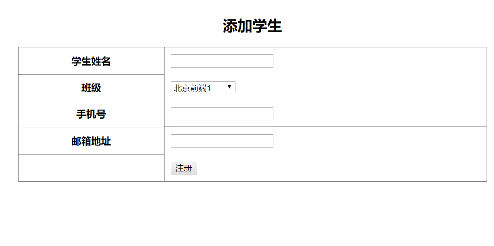
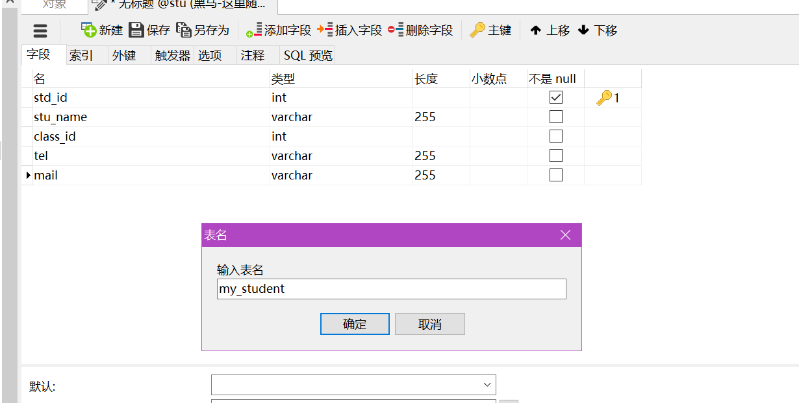
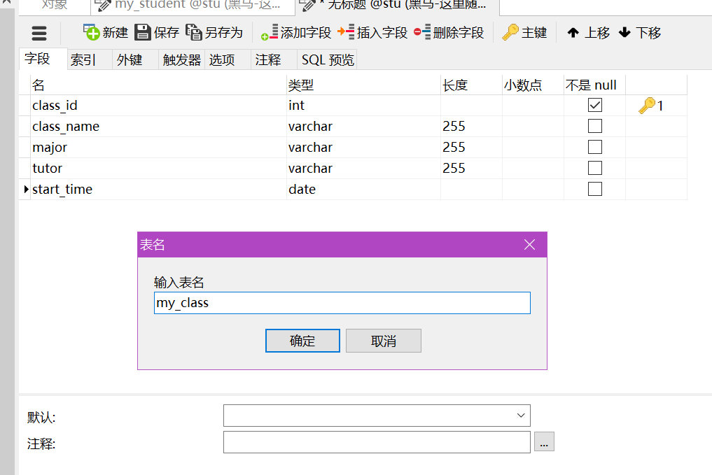

## 引言
我们在导言的时候，说过了，我们的php可以获取到表单传过来的数据

## GET和POST
- 除了表单提交的时候指定提交的方法是post,其他的全是get的提交方式 
- get方式
    + 表单的method是get
    + a链接
    + 直接在地址栏输入

### 分页思路

```
header("content-type:text/html;charset=utf8");
echo "<pre>";
// 预定义变量
print_r($_GET);
// echo '请求的页码为'.$_GET['page'];
$page = $_GET['page'];

// 通过limit子句实现查询数据的分页显示
// select  * from goods limit 4,2;
$pagesize = 2;
// 偏移量
$offset = ($page -1) * $pagesize ;

// 组装SQL语句
$sql ="select * from goods limit $offset,$pagesize";
die($sql);
// select * from goods limit 4,2
```

### 跳转

```php
<?php 
header('location:http://www.baidu.com');
?>
```

```php
<?php 
header('refresh:5;url=http://www.baidu.com');
?>
<!DOCTYPE html>
<html lang="en">
<head>
    <meta charset="UTF-8">
    <meta name="viewport" content="width=device-width, initial-scale=1.0">
    <meta http-equiv="X-UA-Compatible" content="ie=edge">
    <title>Document</title>
</head>
<body>
    <p>还有<span id="sec">5</span>秒跳转</p>
    <script>
    window.onload = function(){
        var sec = document.querySelector('#sec');
        setInterval(function(){
            sec.innerHTML = parseInt(sec.innerHTML) - 1;
        },1000);
    }
    </script>
</body>
</html>
```

## js端的跳转
- location.assign
- location.href

## php结合js端的跳转

```php
//day06用得上类似的代码
echo '<script>location.href = "http://www.baidu.com"</script>;

```

## GET与POST的区别
- GET不安全，且长度有限定
- POST更安全，可用于传输大的数据、上传文件

```
如：IE对URL长度的限制是2083字节(2K+35)。

下面就是对各种浏览器和服务器的最大处理能力做一些说明.

Microsoft Internet Explorer (Browser)

IE浏览器对URL的最大限制为2083个字符，如果超过这个数字，提交按钮没有任何反应。
Firefox (Browser)

对于Firefox浏览器URL的长度限制为65,536个字符。

Safari (Browser)

URL最大长度限制为 80,000个字符。

Opera (Browser)

URL最大长度限制为190,000个字符。

Google (chrome)

URL最大长度限制为8182个字符。

Apache (Server)

能接受最大url长度为8,192个字符。

Microsoft Internet Information Server(IIS)

能接受最大url的长度为16,384个字符。

通过上面的数据可知，为了让所有的用户都能正常浏览， URL最好不要超过IE的最大长度限制(2083个字符），当然，如果URL不直接提供给用户，而是提供给程序调用，这时的长度就只受Web服务器影响了。

注：对于中文的传递，最终会为urlencode后的编码形式进行传递，如果浏览器的编码为UTF8的话，一个汉字最终编码后的字符长度为9个字符。

因此如果使用的 GET 方法，最大长度等于URL最大长度减去实际路径中的字符数。


```

-----> 关于预定义变量，除了$_GET、$_POST,还有很多：

## 预定义变量(超全局变量)
- $_GET：获取所有表单以get方式提交的数据
- $_POST：POST提交的数据都会保存在此
- $_REQUEST：GET和POST提交的都会保存
- $GLOBALS：PHP中所有的全局变量
- $_SERVER：服务器信息 了解即可
- $_ENV：环境信息 了解即可
- $_FILES：用户上传的文件信息 后面会学
- $_SESSION：session会话数据 后面会学
- $_COOKIE：cookie会话数据 后面会学

## POST综合案例

### 下拉菜单相关

#### 下拉菜单提交数据

```php
<!DOCTYPE html>
<html lang="en">
<head>
    <meta charset="UTF-8">
    <meta name="viewport" content="width=device-width, initial-scale=1.0">
    <meta http-equiv="X-UA-Compatible" content="ie=edge">
    <title>Document</title>
</head>
<body>
    <form action="" method="POST">
    最喜欢的车：
        <select name="car">
            <option value="BMW">BMW</option>
            <option value="BENZ">BENZ</option>
            <option value="Fararri">Fararri</option>
            <option value="AUDI">AUDI</option>
            <option value="INFINITI">INFINITI</option>
        </select>
        <input type="submit" value="提交">
    </form>
</body>
</html>
```

#### 下拉菜单数据接收

```php
<?php 
$car = $_POST['car'];
echo $car;
?>
<!DOCTYPE html>
<html lang="en">
<head>
    <meta charset="UTF-8">
    <meta name="viewport" content="width=device-width, initial-scale=1.0">
    <meta http-equiv="X-UA-Compatible" content="ie=edge">
    <title>Document</title>
</head>
<body>
    <form action="" method="POST">
    最喜欢的车：
        <select name="car">
            <option value="BMW">BMW</option>
            <option value="BENZ">BENZ</option>
            <option value="Fararri">Fararri</option>
            <option value="AUDI">AUDI</option>
            <option value="INFINITI">INFINITI</option>
        </select>
        <input type="submit" value="提交">
    </form>
</body>
</html>
```

#### 防止出现警告提示信息

```php
<?php 
if(!empty($_POST)){
    $car = $_POST['car'];
    echo $car;
}
?>
<!DOCTYPE html>
<html lang="en">
<head>
    <meta charset="UTF-8">
    <meta name="viewport" content="width=device-width, initial-scale=1.0">
    <meta http-equiv="X-UA-Compatible" content="ie=edge">
    <title>Document</title>
</head>
<body>
    <form action="" method="POST">
    最喜欢的车：
        <select name="car">
            <option value="BMW">BMW</option>
            <option value="BENZ">BENZ</option>
            <option value="Fararri">Fararri</option>
            <option value="AUDI">AUDI</option>
            <option value="INFINITI">INFINITI</option>
        </select>
        <input type="submit" value="提交">
    </form>
</body>
</html>
```

#### 根据下拉菜单接收的POST数据，对下拉表单设置默认值

```php
<?php 
if(!empty($_POST)){
    $car = $_POST['car'];
    echo $car;
}
?>
<!DOCTYPE html>
<html lang="en">
<head>
    <meta charset="UTF-8">
    <meta name="viewport" content="width=device-width, initial-scale=1.0">
    <meta http-equiv="X-UA-Compatible" content="ie=edge">
    <title>Document</title>
</head>
<body>
    <form action="" method="POST">
    最喜欢的车：
        <select name="car">
            <option value="BMW" <?php if(isset($car) && $car == 'BMW')echo 'selected'?>>BMW</option>
            <option value="BENZ" <?php if(isset($car) && $car == 'BENZ')echo 'selected'?>>BENZ</option>
            <option value="Fararri" <?php if(isset($car) && $car == 'Fararri')echo 'selected'?>>Fararri</option>
            <option value="AUDI" <?php if(isset($car) && $car == 'AUDI')echo 'selected'?>>AUDI</option>
            <option value="INFINITI" <?php if(isset($car) && $car == 'INFINITI')echo 'selected'?>>INFINITI</option>
        </select>
        <input type="submit" value="提交">
    </form>
</body>
</html>
```

### 单选框数据处理

```php
<?php 
print_r($_POST);
if(!empty($_POST)){
    $car = $_POST['car'];
    echo $car;
    $sex = $_POST['sex'];
}
?>
<!DOCTYPE html>
<html lang="en">
<head>
    <meta charset="UTF-8">
    <meta name="viewport" content="width=device-width, initial-scale=1.0">
    <meta http-equiv="X-UA-Compatible" content="ie=edge">
    <title>Document</title>
</head>
<body>
    <form action="" method="POST">
    最喜欢的车：
        <select name="car">
            <option value="BMW" <?php if(isset($car) && $car == 'BMW')echo 'selected'?>>BMW</option>
            <option value="BENZ" <?php if(isset($car) && $car == 'BENZ')echo 'selected'?>>BENZ</option>
            <option value="Fararri" <?php if(isset($car) && $car == 'Fararri')echo 'selected'?>>Fararri</option>
            <option value="AUDI" <?php if(isset($car) && $car == 'AUDI')echo 'selected'?>>AUDI</option>
            <option value="INFINITI" <?php if(isset($car) && $car == 'INFINITI')echo 'selected'?>>INFINITI</option>
        </select>
    性别：
    <input type="radio" name="sex" value="1" <?php if(isset($sex) && $sex =='1' )echo 'checked';?>>男
    <input type="radio" name="sex" value="2" <?php if(isset($sex) && $sex =='2' )echo 'checked';?>>女
        <input type="submit" value="提交">
    </form>
</body>
</html>
```

### 复选框的数据处理

```php
<?php 
header("content-type:text/html;charset=utf8");
if(!empty($_POST)){
	// print_r($_POST);die;
	$car =$_POST['car'];
	$sex =$_POST['sex'];
	$books=$_POST['books'];//数组
	// print_r($books);
	$books =implode(',',$books);//字符串
	echo $car.'---'.$sex.'---'.$books;
}
?>
<!DOCTYPE html>
<html>
<head>
<meta charset="utf-8">
<meta http-equiv="X-UA-Compatible" content="IE=edge,chrome=1">
<title>Examples</title>
<meta name="description" content="">
<meta name="keywords" content="">
<link href="" rel="stylesheet">
</head>
<body>
    <form action="" method="POST">
    	最喜欢的车：
    	<select name="car" id="">
    		<option value="BMW" <?php if(isset($car) && $car == 'BMW' ) echo 'selected'?>>BMW</option>
    		<option value="BENZ" <?php if(isset($car) && $car == 'BENZ' ) echo 'selected'?>>BENZ</option>
    		<option value="Fararri" <?php if(isset($car) && $car == 'Fararri' ) echo 'selected'?>>Fararri</option>
    		<option value="AUDI" <?php if(isset($car) && $car == 'AUDI' ) echo 'selected'?>>AUDI</option>
    		<option value="INFINITI" <?php if(isset($car) && $car == 'INFINITI' ) echo 'selected'?>>INFINITI</option>
    	</select><br />
    	性别：
    	<input type="radio" name="sex" id="" value="1" <?php if(isset($sex) && $sex == 1) echo 'checked'?>>男
    	<input type="radio" name="sex" id="" value="2" <?php if(isset($sex) && $sex == 2) echo 'checked'?>>女
    	<input type="radio" name="sex" id="" value="3" <?php if(isset($sex) && $sex == 3) echo 'checked'?>>中<br />
    	最喜欢的书：
    	<input type="checkbox" name="books[]" id="" value="我是小说家">我是小说家
    	<input type="checkbox" name="books[]" id="" value="岁月留痕">岁月留痕
    	<input type="checkbox" name="books[]" id="" value="白夜行">白夜行
    	<input type="checkbox" name="books[]" id="" value="诗经">诗经<br />
    	<input type="submit" value="提交">
    </form>
</body>
</html>
```

## 学生信息注册(38:00 自己做出来)
传智播客黑马程序员在全国各个小区开设各个专业、诸多班级。现在系统中录入学生，包括学生的学号、姓名，班级，手机号、邮箱等信息。


设计稿如下：



前端工程师提供的静态代码如下：

```html
<!DOCTYPE html>
<html lang="en">
<head>
	<meta charset="UTF-8">
	<title>学生信息注册</title>
</head>
<body>
	<form>
		<table width="60%" align="center" border="1" rules="all" cellpadding="10">
			<caption><h2>添加学生</h2></caption>
			<tr>
				<th>学生姓名</th>
				<td><input type="text" name="name" id=""></td>
			</tr>
			<tr>
				<th>班级</th>
				<td><select name="class_id" id="">
					<option value="1">北京前端1</option>
					<option value="2">上海前端1</option>
					<option value="3">深圳JavaEE1</option>
					<option value="4">北京PHP1</option>
				</select></td>
			</tr>
			<tr>
				<th>手机号</th>
				<td><input type="text" name="tel" id=""></td>
			</tr>
			<tr>
				<th>邮箱地址</th>
				<td><input type="text" name="mail" id=""></td>
			</tr>
			<tr>
				<td></td>
				<td><input type="submit" value="注册"></td>
			</tr>			
		</table>
	</form>
</body>
</html>
```

思考用户操作逻辑：
1. 用户填写好表单
2. 点击提交按钮
3. php获取数据(用POST)
4. 构建插入SQL语句

### 第一步、完善表单html代码

```php
<!DOCTYPE html>
<html lang="en">
<head>
	<meta charset="UTF-8">
	<title>学生信息注册</title>
</head>
<body>
	<form action="./student_add_post.php" method="POST">
		<table width="60%" align="center" border="1" rules="all" cellpadding="10">
			<caption><h2>添加学生</h2></caption>
			<tr>
				<th>学生姓名</th>
				<td><input type="text" name="name" id=""></td>
			</tr>
			<tr>
				<th>班级</th>
				<td><select name="class_id" id="">
					<option value="1">北京前端1</option>
					<option value="2">上海前端1</option>
					<option value="3">深圳JavaEE1</option>
					<option value="4">北京PHP1</option>
				</select></td>
			</tr>
			<tr>
				<th>手机号</th>
				<td><input type="text" name="tel" id=""></td>
			</tr>
			<tr>
				<th>邮箱地址</th>
				<td><input type="text" name="mail" id=""></td>
			</tr>
			<tr>
				<td></td>
				<td><input type="submit" value="注册"></td>
			</tr>			
		</table>
	</form>
</body>
</html>
```


### 第二步、构建接收POST数据的php文件代码(阶段一：大家一起照着做出来)

```php
<?php 
header('content-type:text/html;charset=utf8');
print_r($_POST);
?>
```

### 第三步、创建数据库


### 第四步、设计表

设计数据库表的原则：
1、默认一张表
2. 一个表单文本框对应一个字段
3. 再添加一个id


```
stu_id 学生id
stu_name 学生名字
class_name 班级名称
tel 电话
mail 邮箱
major 专业
tutor 班主任名称
start_time 开班时间
```

4、当把表设计好之后，看一下哪些字段比较冗余
    + class_name冗余
    + major冗余
    + tutor冗余
    + start_time冗余
5、把冗余的提取出来作为一个新的表 --> 拆表

```
//my_student表
stu_id int primary key auto_increment
stu_name varchar
class_id int
tel char(11)
mail varchar
```



```
//my_class表
class_id int primary key auto_increment
class_name vaarchar
major varchar
tutor varchar
start_time date
```



### 第五步、填充假数据

```sql
-- ----------------------------
-- Records of my_class
-- ----------------------------
INSERT INTO `my_class` VALUES ('1', '北京前端1', '前端与移动开发', '赵老师', '2018-04-01');
INSERT INTO `my_class` VALUES ('2', '北京前端2', '前端与移动开发', '李老师', '2018-03-01');
INSERT INTO `my_class` VALUES ('3', '南京java', 'java', '王老师', '2018-03-02');
INSERT INTO `my_class` VALUES ('4', '武汉PHP', 'PHP', '马老师', '2018-02-27');
```

```sql
INSERT INTO `my_student` VALUES ('1', '成同学', '1', '13812345678', 'wefwe@qq.com');
INSERT INTO `my_student` VALUES ('2', '李同学', '2', '13812345678', 'wefw@qq.com');
INSERT INTO `my_student` VALUES ('3', '马同学', '3', '12412345678', 'wfewf@qq.com');
INSERT INTO `my_student` VALUES ('4', '李同学', '3', '234232332', 'wefwefwe@qq.com');
```

### 第六步、根据用户传入的POST数据构建SQL语句

```php
<?php 
header('content-type:text/html;charset=utf8');
// print_r($_POST);
$name = $_POST['name'];
$class_id = $_POST['class_id'];
$tel = $_POST['tel'];
$mail = $_POST['mail'];

$sql ="insert into my_student values (null,'$name',$class_id,'$tel','$mail')";
die($sql);
?>
```

### 第七步、用户名、手机不能为空

```php
<?php 
header('content-type:text/html;charset=utf8');
// print_r($_POST);
$name = $_POST['name'];
$class_id = $_POST['class_id'];
$tel = $_POST['tel'];
$mail = $_POST['mail'];
if(empty($name) || empty($mail)){
    header('refresh:3;url=./5-student-add.php');
   echo "<script>alert('姓名以及手机号不能为空')</script>";
   die();
}
$sql ="insert into my_student values (null,'$name',$class_id,'$tel','$mail')";
die($sql);
?>
```


## 文件上传

### 前端页面设置
- enctype
- method="POST"

### 文件上传接收
- $_FILES
- 文件类型(mime http://www.w3school.com.cn/media/media_mimeref.asp)

```php
$_FILES["file"]["name"] - 被上传文件的名称
$_FILES["file"]["type"] - 被上传文件的类型
//1G = 1024M
//1M = 1024 kb
//1kb = 1024 byte
// 1byte = 8bit
//两个字节相当于一个汉字
//16bit = 1个汉字
$_FILES["file"]["size"] - 被上传文件的大小，以字节计   
$_FILES["file"]["tmp_name"] - 存储在服务器的文件的临时副本的名称
$_FILES["file"]["error"] - 由文件上传导致的错误代码
```

```
错误代码：
值：0; 没有错误发生，文件上传成功。 
值：1; 上传的文件超过了 php.ini 中 upload_max_filesize 选项限制的值。(默认是2M) 
值：2; 上传文件的大小超过了 HTML 表单中 MAX_FILE_SIZE 选项指定的值。 
值：3; 文件只有部分被上传。 
值：4; 没有文件被上传。 
值：5; 上传文件大小为0. 
```

可以通过在form表单中设置<input type="hidden" name="MAX_FILE_SIZE" value="1000">来限定上传的数据大小极限

### 文件上传完整步骤
1. 设计表单
    + enctype值为multipart/form-data
    + method为POST
2. 接收数据$_FILES
3. 通过$_FILES['myFileName']['error']判断出错信息
4. 判断文件是否是HTTP POST上传的文件
    + is_uploaded_file(临时文件路径$_FILES['myFileName']['tmp_name'])
    + 返回true(合法的POST文件)
5. 把文件从tmp临时目录中移动到网站永久路径
    + move_uploaded_file(临时路径$_FILES['myFileName']['tmp_name']永久路径)


### 文件上传实例

```php
// ① 判断上传是否发生严重错误
if(empty($_FILES)){
	die('上传发生严重错误');
}

print_r($_FILES['upload']);
// Array
// (
//     [name] => 404.png
//     [type] => image/png
//     [tmp_name] => C:\Users\julien\AppData\Local\Temp\phpB3BE.tmp
//     [error] => 0
//     [size] => 11504
// )
$file =$_FILES['upload'];

// ②判断错误
if($file['error'] != 0){
	$errorMsg ='';

	switch($file['error']){
		case 1:
			$errorMsg ='超过2M';
			break;
		case 4:
			$errorMsg ='未选择文件';
			break;
		case 6:
			$errorMsg ='临时路径出错';
			break;
		default :
			$errorMsg ='未知错误';
	}

	die("<h4>".$errorMsg."</h4>");

}

// ③判断是否是合法HTTP POST上传文件
if(!is_uploaded_file($file['tmp_name'])){
	die('非法上传文件');
}
// 判断文件大小是否满足要求 1.1M
$maxSize =1.1;
if($maxSize * 1024 * 1024 <  $file['size']){
	die('文件大小超过'.$maxSize.'M');
}

// 判断文件类型是否是支持的类型
// 1、打开finfo资源
$resource  =finfo_open(FILEINFO_MIME_TYPE);
// var_dump($resouce);die;
 // resource(2) of type (file_info) 
 
$mime =finfo_file($resource,$file['tmp_name']);
var_dump($mime);die;
// "image/jpeg" 

// 网站支持的MIME类型
$mimeArr =['image/png','image/jpeg'];
if(!in_array($mime, $mimeArr)){
	die('文件类型不支持');
}

// ④移动临时文件到永久路径
// 永久路径：./upload/a.png
$ext =strrchr($file['name'],'.');
// die($ext);.png
// $savePath ='./upload/'.$file['name'];
$savePath='./upload/'.date('YmdHis-').mt_rand(1000,9999).$ext;
// die($savePath);//./upload/20171012164341-7330.png
// ./upload/404.png

if(move_uploaded_file($file['tmp_name'], $savePath)){
	echo $file['name']."上传成功";
}else{
	echo $file['name']."移动发生错误";
}
```

### 文件上传相关问题
- 万一两个用户上传的文件名字一样怎么办?

## 晚上的任务
- 把sql语句复习一下
