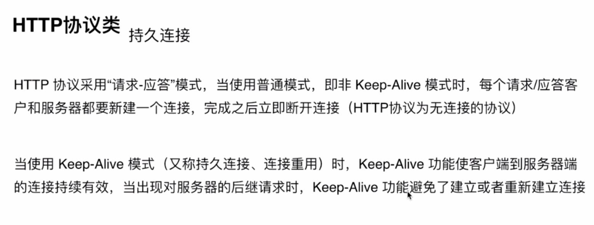
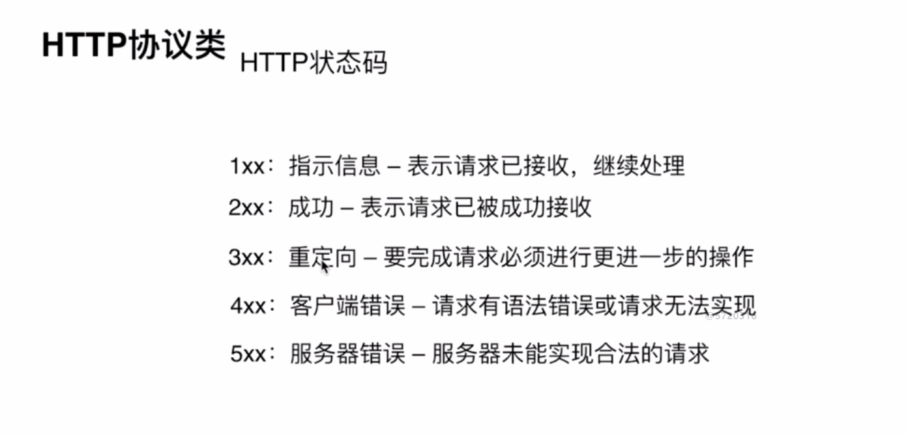
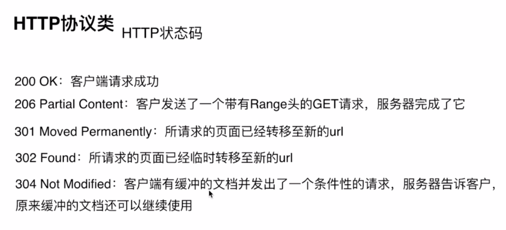
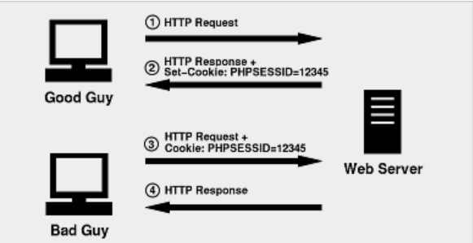
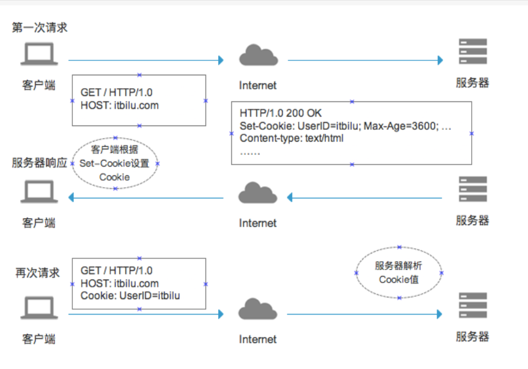

## 导言
- 我们在day05的时候，超全局变量有提到$_COOKIE,$_SESSION，今天咱们就来学习这二个东西

## 1-HTTP协议介绍.avi
- 打开network --> header进行查看(熟悉了解network,从这里可以看出来是GET、POST，状态码是多少)



200	ok	请求成功
302	found	重定向
403	forbidden	禁止访问
404	not found 	页面不存在
500	internal server error	服务器内部错误





##### 请求头

客户端想要告诉服务端的一些额外信息，以下为常见的请求头：

| 键               | 值                           |
| --------------- | --------------------------- |
| Host            | 请求的主机                       |
| Cache-Control   | 控制缓存（例如：max-age=60 缓存 60 秒） |
| Accept          | 客户端想要接收的文档类型，逗号分隔           |
| User-Agent      | 标识什么客户端帮你发送的这次请求            |
| Referer         | 这次请求的来源                     |
| Accept-Encoding | 可以接受的压缩编码                   |
| Cookie          | 客户端本地的小票信息                  |

##### 请求体(这个一定要了解，后面ajax会提及到)

这次请求客户端想要发送给服务端的数据正文，一般在 GET 请求时很少用到，因为 GET 请求主观上都是去“拿东西”。

##### 状态行

`HTTP/1.1 200 OK`

HTTP 协议版本 + 空格 + 状态码 + 空格 + 状态描述

##### 响应头

服务端想要告诉客户端的一些额外信息，常见的有以下：

| 键              | 值          |
| -------------- | ---------- |
| Date           | 响应时间       |
| Server         | 服务器信息      |
| Content-Type   | 响应体的内容类型   |
| Content-Length | 响应的内容大小    |
| Set-Cookie     | 让客户端设置一个小票 |

如果需要在程序中设置自定义的响应头（不是预设的），建议使用 `X-<Property-Name>` 规则

##### 响应体

这次请求服务端想要返回给客户端的数据正文，一般返回的都是 HTML，也可以返回 JavaScript 或者 CSS（需要修改响应头中的响应类型）。

常见状态代码、状态描述的说明如下。

- 200 OK：客户端请求成功。
- 400 Bad Request：客户端请求有语法错误，不能被服务器所理解。
- 401 Unauthorized：请求未经授权，这个状态代码必须和 `WWW-Authenticate` 报头域一起使用。
- 403 Forbidden：服务器收到请求，但是拒绝提供服务。
- 404 Not Found：请求资源不存在，举个例子：输入了错误的URL。
- 500 Internal Server Error：服务器发生不可预期的错误。
- 503 Server Unavailable：服务器当前不能处理客户端的请求，一段时间后可能恢复正常。

### 理解会话
- 会话指的是客户端向服务器端建立了连接，没有断开之前这个过程
    + 客户端指的是浏览器软件，从这里大家可以得出结论，同一台的电脑上的两个不同的浏览器是互相没有关联的
    + 这个东西大家应该能体会出来，我们平时在A浏览器登录了账号密码，B浏览器还需要再来一次
    + 用平述的语言可以解释为：你拨打你朋友的电话号码，你朋友接听，然后一翻各种聊，直到任何一方挂电话，这个过程就是一个会话
- 无状态
    + 人生若只如初见
    + 服务员记忆差，把每个客人当成新的客户


```
//有状态
A:
A：你今天吃了什么?
B:大盘鸡
A：好吃吗?
B:好吃
```
//无状态
A：你今天吃了什么?
B:大盘鸡
A：好吃吗?
B:什么好吃，啥意思?

```
//携带cookie
A：你今天吃了什么?
B:大盘鸡
A：你今天吃的大盘鸡好吃吗?
B:好吃
```

两个页面之间是无状态的，怎么确认自己登录过了?

## 2-会话技术介绍--cookie.avi


- 把那个小花花的例子做出来
    + 需求：第一次访问就会送一朵小花，再次再来就不会送小花，同时提示用户不要太贪心

- 通过上面的例子画cookie的流程图



- 通过浏览器来查看cookie或者通过editThisCookie来查看

- 在同一个网站同一个目录创建另一个php文件进行查看cookie

问题：
1、关掉浏览器，再次打开查看效果
2、在上一级目录中打印$_COOKIE的值

## 3-cookie属性1_有效时间、有效范围.avi
- setcookie('gift','flower',time()+1*24*60*60);
- setcookie('gift','flower',time()+1*24*60*60,'/');

```php
<?php 
// print_r($_COOKIE);
if(empty($_COOKIE)){
    setcookie('gift','flower',time()+1*24*60*60,'/');
    // setcookie()
    $first = true;
}else{
    $first = false;
}
?>
<!DOCTYPE html>
<html lang="en">
<head>
    <meta charset="UTF-8">
    <meta name="viewport" content="width=device-width, initial-scale=1.0">
    <meta http-equiv="X-UA-Compatible" content="ie=edge">
    <title>Document</title>
</head>
<body>
    <?php if($first){?>
    <h1>送你一朵小花</h1>
    <?php }else{?>
    <h1>不要太贪心</h1>
    <?php }?>
</body>
</html>
```

```
print_r($_COOKIE);
``` 


## 4-cookie属性2_有效域名.avi
- setcookie('gift','flower',time()+1*24*60*60,'/','.域名.com');

### cookie的缺点
- 容易伪造
- 举例子：工作服的例子
- 举例子：超市存柜

很久以前，为了完成HTTP会话的状态，互联网的设计者们想到了一个办法，就是在浏览器中存储用户信息，每次请求都是向服务器端发送这些信息，这样服务器就知道发送者是谁，但是很快问题就来了，张三冒充李四的相关信息发送给张三，为了安全起见，互联网老大哥们又杨到一个识别用户身份的办法，就是把客户信息存储在服务器端，一切用户的身份由服务器指定。

SESSION的原理：
首先，用户向服务器发送一个请求，服务器端接收到请求后，生成相应的会话信息，核心是会话id,把它存起来，下一次发送请求的时候，附带着这个会话ID一起发送给服务器端，服务器只要根据这个会话ID，就知道是谁了。这个会话ID，就像我们人的身份证。


## 5-session数据基本语法.avi
- session的存放位置(去php.ini中找session.save_path="C:\phpStudy\PHPTutorial\tmp\tmp")

```php
session_start();
$_SESSION['a'] = 'abc';
```

- 删除session
    + 删除一个值 unset($_SESSION['a'])
    + 删除所有 $_SESSION = []
    + 销毁 session_destroy()

- 补充session知识点
    + session必须基于cookie来实现
    + session只存在一次会话当中


## 6-会话技术实现登录模块.avi
- 先看最终的效果，理解我们要完成的需求是什么样子的
- 创建管理员表并填充假数据
    + md5函数,大家可以自行百度查一下，md5加密之后，基本上破解的可能性很低的，十分的安全

```sql
create table my_admin(
user_id int primary key auto_increment,
user_name varchar(20) not null unique key,
password char(32) not null
);

#注册管理员
#md5 mysql系统函数 加密之后 32位字符串
insert into my_admin values (null,'fe2017',md5('123456'));
```

- 创建login.php页面

```php
<!DOCTYPE html>
<html lang="en">
<head>
    <meta charset="UTF-8">
    <meta name="viewport" content="width=device-width, initial-scale=1.0">
    <meta http-equiv="X-UA-Compatible" content="ie=edge">
    <title>Document</title>
</head>
<body>
    <form action="./login_handler.php" method="POST">
        <input type="text" name="user_name">
        <input type="password" name="password">
        <input type="submit">
    </form>
</body>
</html>
```

- 创建login_handler.php处理login.php的数据提交

```php
<?php 
print_r($_POST);
?>
```

- 创建SQL语句，去数据库中进行查询数据

```php
<?php 
// print_r($_POST);
include "./connect.php";
$user_name = $_POST['user_name'];
$password1  = $_POST['password'];
$sql = "select count(*) as total from my_admin where user_name = '$user_name' and password = md5('$password1')";
// echo $sql;
$result = mysql_query($sql);
// var_dump($result);
$data = mysql_fetch_assoc($result);
// var_dump($data);
// echo $data['total'];
if($data['total'] == 1){
    //登录成功
}else{
    //登录失败
}
```

- 登录成功之后，开启session,把登录成功的信息写入session,登录失败，跳转回login.php

```php
<?php 
// print_r($_POST);
include "./connect.php";
$user_name = $_POST['user_name'];
$password1  = $_POST['password'];
$sql = "select count(*) as total from my_admin where user_name = '$user_name' and password = md5('$password1')";
// echo $sql;
$result = mysql_query($sql);
// var_dump($result);
$data = mysql_fetch_assoc($result);
// var_dump($data);
// echo $data['total'];
if($data['total'] == 1){
    //登录成功
    session_start();
    $_SESSION['user_name'] = $user_name;
    header('refresh:1;url=./index.php');
}else{
    //登录失败
    header('refresh:1;url=./login.php');
}
```

- 插入页面在一开始的时候判断用户是否登录，如果未登录，则跳转到登录页

```php
<?php 
header('content-type:text/html;charset=utf8');
session_start();
if(empty($_SESSION['user_name'])){
    header('refresh:1;url=./login.php');
    die();
}
include './connect.php';
// print_r($_POST);
// print_r($_FILES);
$file = $_FILES['upload'];
//1. 判断文件上传是否有错误
if($file['error'] !=0){
    $errMsg = '';
    switch($file['error']){
        case 1:
            $errMsg = '超过2M';
            break;
        case 4:
            $errMsg = '未选择的文件';
            break;
        case 6:
            $errMsg = '临时路径出错';
            break;
        default:
            $errMsg = '未知错误';
    }

    die($errMsg);
}

//2. 判断是否是合法HTTP POST上传文件
if(!is_uploaded_file($file['tmp_name'])){
    die('非法上传文件');
}

//3. 判断文件大小是否满足要求1.1M
$maxSize = 1.1;
if($maxSize * 1024 * 1024 < $file['size']){
    die('文件大小超过'.$maxSize.'M');
}

//判断文件类型是否支持的类型
//1. 打开finfo资源
$resource = finfo_open(FILEINFO_MIME_TYPE);
$mime = finfo_file($resource,$file['tmp_name']);
// var_dump($mime);
// die();

//网站支持的MIME类型
$mimeArr = ['image/png','image/jpeg'];
if(!in_array($mime,$mimeArr)){
    die('文件类型不支持');
}

//移动临时文件到永久路径
//永久路径 ./upload 
$ext = strrchr($file['name'],'.');
$savePath = './upload/'.date('YmdHis-').mt_rand(1000,9999).$ext;
// echo $savePath;

if(move_uploaded_file($file['tmp_name'],$savePath)){
    // echo $file['name'].'上传成功';
    //开始构建插入SQL语句
    $stu_name = $_POST['stu_name'];
    $age = $_POST['age'];
    $sex = $_POST['sex'];
    $class_id = $_POST['class_id'];
    $tel = $_POST['tel'];
    $sql = "insert into my_stu (stu_name,age,sex,class_id,tel,pics) values('$stu_name',$age,'$sex',$class_id,'$tel','$savePath');";
    // echo '<br>';
    echo $sql;
    $result = mysql_query($sql);
    var_dump($result);
    if($result){
        //成功
        header('refresh:1;url=./index.php');
    }else{
        //失败
        echo '<script>alert("插入失败");history.go(-1);</script>';
    }
}else{
    echo $file['name'].'移动发生错误';
}
```

- 把验证是否登录提取出来，check_login.php当中，然后在添加、插入、修改页面包含即可

```php
//check_login.php
<?php 
session_start();
if(empty($_SESSION['user_name'])){
    header('refresh:1;url=./login.php');
    die();
}
?>
```

- 让首页退出登录只显示一个链接

```php
<?php 
session_start();
include './connect.php';
$sql = 'select * from my_stu';
$results = mysql_query($sql);
// var_dump(mysql_num_rows($results));
mysql_num_rows($results) > 0 or die('暂无数据');
$data = [];
while($row = mysql_fetch_assoc($results)){
	$data[] = $row;
}
// print_r($data);
?>
<!DOCTYPE html>
<html lang="en">
<head>
	<meta charset="UTF-8">
	<title>首页</title>
</head>
<body>
	<p style="display: flex;flex-direction: row-reverse;">
		<a href="./add.php">添加学生</a>&nbsp;&nbsp;
		<?php if(!@$_SESSION['user_name']){?>
			<a href="./login.php">登录</a>&nbsp;&nbsp;
		<?php }else{?>
			<a href="./logout.php">退出</a>
		<?php }?>
	</p>
	<table width="50%" border="1" rules="all" cellpadding="8" align="center">
		<caption><h2>学生列表</h2></caption>
		<tr>
			<td>学号</td>
			<td>姓名</td>
			<td>手机号</td>
			<td>操作</td>
		</tr>
		<?php for($i=0;$i<count($data);$i++){ ?> 
		<tr>
			<td><?php echo $data[$i]['stu_id'] ?></td>
			<td><a href="./detail.php?stu_id=<?php echo $data[$i]['stu_id'] ?>"><?php echo $data[$i]['stu_name'] ?></a></td>
			<td><?php echo $data[$i]['tel'] ?></td>
			<td><a href="./edit.php?stu_id=<?php echo $data[$i]['stu_id'] ?>">修改</a> || 删除</td>
		</tr>
		<?php } ?>
	</table>
</body>
</html>
```


- 退出功能实现

```php
<?php 
session_start();
session_destroy();
header('refresh:1;url=./index.php');
```


