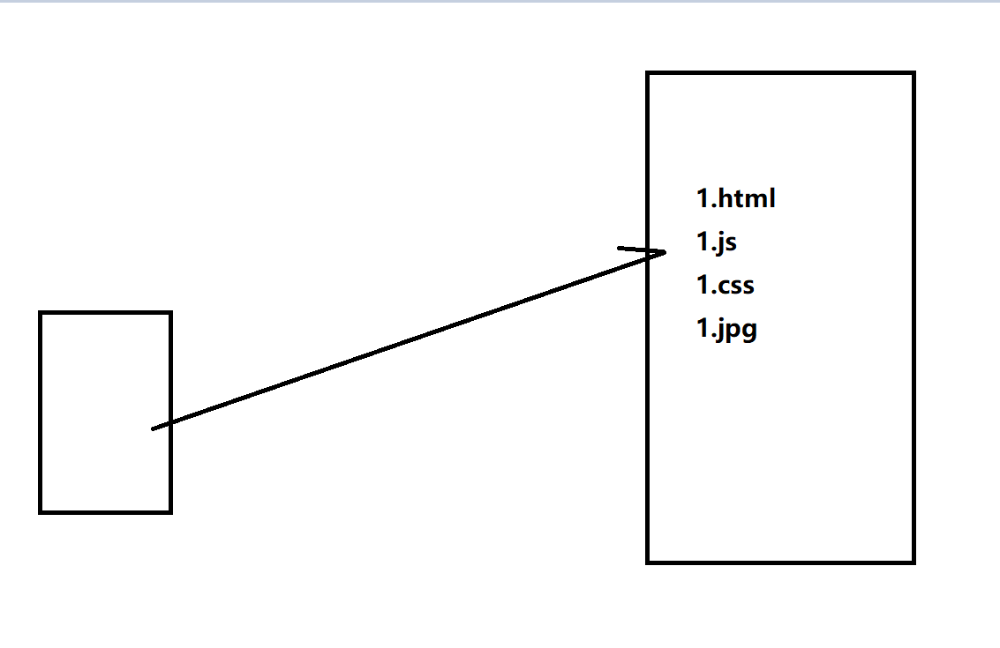
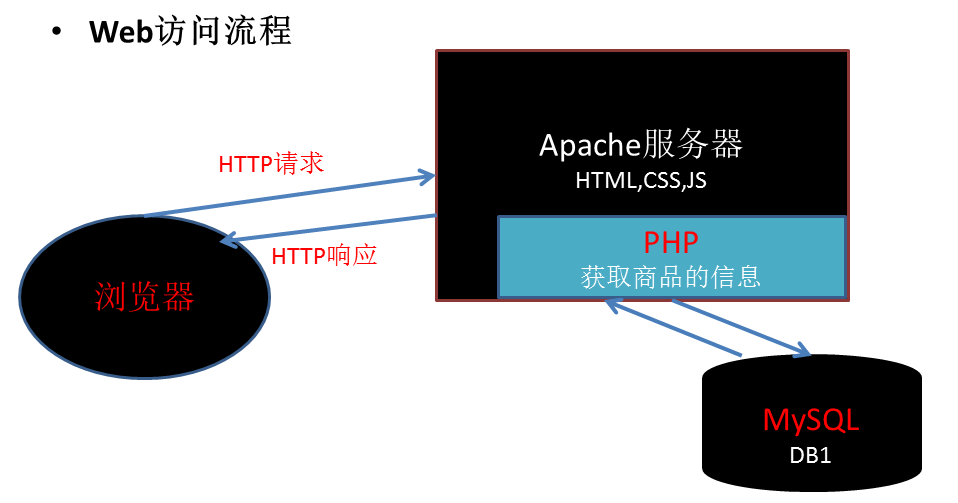

## 导学
- 为什么要有这个导学课程
    + php课程有一定的难度
    + 每个人的基础不太一样，有的同学有计算机基础，有的同学并没有计算机基础，为了让大家学习进度尽量保持一致
    + 对整个课程要学的东西大概有一个认识，避免在学习的过程当中总是不知道在干嘛，造成不想学的情况
- 大家在来传智的时候，好多同学应该不是一上来就选择的前端这个专业，肯定在很多专业之间挑选过，大家回想一下，传智还有哪些课程??(只考虑编程方面的)
    + java,php,python,前端


从大的方面来划分的话：可以划分为前端与后端

- 如何理解前端与后端


--> 感性认识前端与后端
- 一个国家，从大的层面上来划分
    + 开辟新疆土 ---> 武将 ---> 前端
    + 后勤、守城者 ---> 主要是文官体系 ---> 后端
- 一个公司，从大的层面上来划分
    + 挣钱的部分：业务员、销售员 ---> 前端
    + 花钱的部分：财务、HR... ---> 后端

- 我们通过如下的图示来理解一下整个过程：

大家这块可以思考一下，我们在没有学习前端之前，平时上网的习惯是什么样子的：（在地址栏输入一个网址，然后按下回车即可）


大家可以想一下，上图的整个流程其实我们现实生活中经常会遇到，比如去商店去买东西，我们是客户，商店为我们提供服务。

在上图当中，前端关心的是用户看到的东西，而后端是侧重于为客户端用户提供相应的资源文件(像如下的js,css,jpg,html文件)



上图是我们能够想像得到的，我们平时之所以能够访问网上的资源，是因为在网上真的有一台电脑，对应的有一个域名或者ip地址，然后我们访问的时候，那台电脑就把对应的东西返回给我们了。
---> js是用来做前端的
---> php就是用来做后端的
---> php的历史
	http://php.net/manual/zh/history.php.php ---> 一门古老的语言


- 学习php的作用
    + 后面的ajax课程相当重要，php课程是为ajax课程服务的
    + 让大家从此以后对整个互联网的前端、后端在作的事情有一定的理解（以后去公司之后，不会说不知道公司的java,php等工程师在干嘛，便于我们以后更好的与同事进行配合）
    + 老板要让你搭建一个论坛
    + 老板要让你搭建一个公司博客
    + 公司需要做微信公众号
    + 说不定有一天，大家对后端感兴趣了，想转行也有一个基础


正如我们看电影，必须要安装播放器一样，播放器是提供一个播放的环境，php的运行也需要一个环境，我们的php必须在服务器端软件才能运行，我们这里用的服务器软件叫phpStudy(先安装好这个软件，再来理解服务器是怎么回事)

- 试验一下能不能访问我购买的虚拟主机
    + 购买域名和主机.doc
    + 大家以后学完了以后也可以自己购买，到时候在找工作的时候，可以提前把自己做的东西放上去

- 安装phpStudy软件

- 如何理解phpStudy软件
    + phpStudy是一个服务器端软件

- 如何理解服务器端
    + 大家第一次听说服务器应该是在网游世界中听到的
    + 我们直观的印象是
        1. 玩游戏下一个客户端
        2. 玩游戏必须要联网
        3. 玩游戏必须要登上服务器
    + 服务器：提供服务，就像一个商店一样，有人需要什么东西，服务员就去找一找有没有这个东西，如果有，就找出来给他
    + 客户端：类似QQ、网游之类的都叫客户端


- phpStudy是服务器端，浏览器是客户端
    + 做实验
        1. 打开WWW根目录
        2. 在里面创建一个1.html文件
        3. 通过ipconfig命令获取自己电脑的ip地址
        4. 通过浏览器进行访问这个文件
        5. 把url地址发给同桌，让别人也访问一下看能不能访问
        6. 体会一下，这整个过程做完以后，我们访问这个页面的过程是不是和平时上网是一模一样的？

- 实例一

- 实例二
    + php语句都必须以分号结尾，否则会报错

- 实例三

- 实例四

- 实例五

- 实例六

- 实例七

- 实例八

- 实例九

- 接下来，咱们理解两个概念：静态资源与动态资源
    + 静态资源(写死的html,js,css,jpg)
    + 动态资源(实验)

    + 静态资源(js,css,jpg)

大家可以思考一下：


像如上的网页上的东西，会不会是写死的，肯定不会写死，我们平时在网上买的东西，都是有对应的库存的，卖一件少一件，事实上，这种东西是动态的，我们一般称之为动态资源,如下图所示：

    + 动态资源(罗列了库存数量、价格之类的页面)

这块可以演示一下阿里百秀的项目，展示后台修改了或数据库修改了，前端会改变



结论：
1、如果用户请求的是html,js,css之类的静态资源，php后台会直接返回给客户端
2、如果用户请求的是php文件的动态资源，php后台的作用根据用户要请求的数据，从数据库中找到对应的数据，拼接成一个完整的html内容，然后返回给客户端。

表单上传综合

回顾一下之前学过的表单输入框
1. input[type="text"]
2. input[type="password"]
3. input[type="radio"]
4. input[type="checkbox"]
5. input[type="file"]
6. input[type="number"]
7. input[type="color"]
8. select > option
9. input[type="hidden"]

```html
<!DOCTYPE html>
<html lang="en">
<head>
    <meta charset="UTF-8">
    <meta name="viewport" content="width=device-width, initial-scale=1.0">
    <meta http-equiv="X-UA-Compatible" content="ie=edge">
    <title>Document</title>
</head>
<body>
    <input type="radio" checked>
    <input type="checkbox" checked>
    <select name="" id="">
        <option value="a">a</option>
        <option value="b" selected>b</option>
    </select>
</body>
</html>
```

思考：我们都有博学谷账号，我们的账号密码是存在哪里的?


这里给大家演示一下$_POST

总结：
1、php可以用来处理表单数据
2、php可以用来操作数据库
3、php可以向客户端返回动态资源

## 自学内容
- pre标签

```html
<!DOCTYPE html>
<html>
<head> 
<meta charset="utf-8"> 
<title>菜鸟教程(runoob.com)</title> 
</head>
<body>

	var a = 1;
	var b = 2;
	console.log(a+b);
</body>
</html>
```

对比一下上面的代码和下面的代码的区别


```html
<!DOCTYPE <!DOCTYPE html>
<html>
<head> 
<meta charset="utf-8"> 
<title>菜鸟教程(runoob.com)</title> 
</head>
<body>

	var a = 1;
	var b = 2;
	console.log(a+b);
</body>
</html>html>
<html>
<head> 
<meta charset="utf-8"> 
<title>菜鸟教程(runoob.com)</title> 
</head>
<body>

<pre>
	var a = 1;
	var b = 2;
	console.log(a+b);
</pre>

</body>
</html>
```

- 打字游戏 http://zty.pe

- 单词(php相关单词.md)
    + 学会用有道词典(加入单词本)
    + 学会看报错信息
    + 学会google翻译工具

```
Warning: Division by zero in C:\Users\zhengwei\Desktop\server\www.test.com\ceshi.php on line 4
```

## 学习注意事项
0. 这个课程是php学院老师录的，难度系数有一点高，对于咱们前端来说没必要掌握这么多php的细节的，有些知识大家听一下了解即可
1. 前三天要记的东西不少 
    ---> 善于和js类比，你会发现好多东西以前学过，只不过换了一种形式，其实记的东西并不多的
    ---> 记忆卡片、单词本
    ----> 毕竟咱们学的是前端，不是专门搞php的，不用焦虑，大概知道，用的时候知道去哪查
2. 第四天数据库命令 -->多练习
3. 第五天 文件上传比较繁琐 --> 用法固定，笔记记好即可
4. 项目 --> 照着我写好的文档练习即可

## 编辑器
    1. vsCode(讲义中有推荐的php等相关的插件)
    2. sublime(大家自行百度相关的php插件 不推荐使用)
    3. phpstorm(太大，类似webstorm) http://www.oyksoft.com/soft/40722.html?pc=1