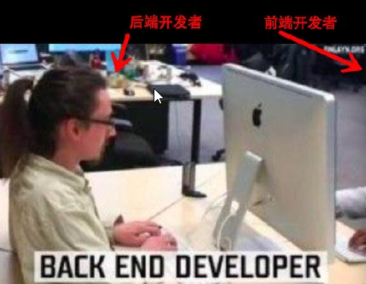
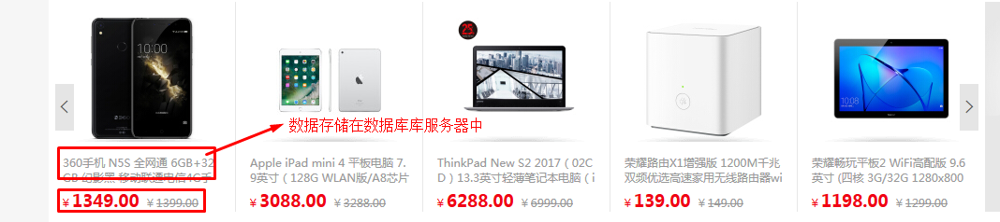

## 导学
- 为什么要有这个导学课程
    + 每个人的基础不太一样，有的同学有计算机基础，有的同学并没有计算机基础，为了让大家学习进度尽量保持一致
    + 对整个课程要学的东西大概有一个认识，避免在学习的过程当中总是不知道在干嘛，造成不想学的情况
- 大家在来传智的时候，好多同学应该不是一上来就选择的前端这个专业，肯定在很多专业之间挑选过，大家回想一下，传智还有哪些课程??
    + java,php,python,前端
        1. 划分：前端与后端
- 如何理解前端与后端




--> 感性认识前端与后端
- 一个国家，从大的层面上来划分
    + 开辟新疆土 ---> 武将 ---> 前端
    + 后勤、守城者 ---> 主要是文官体系 ---> 后端
- 一个公司，从大的层面上来划分
    + 挣钱的部分：业务员、销售员 ---> 前端
    + 花钱的部分：财务、HR... ---> 后端

事实上，从大的方向来划分的话，整个互联网世界，划分为前端与后端两大部分

- 画图理解我们平时看到的一个网页是的访问流程
    
通过ipconfig获取我的电脑的ip地址，然后访问几个静态资源


上图是我们能够想像得到的，我们平时之所以能够访问网上的资源，是因为在网上真的有一台电脑，对应的有一个域名或者ip地址，然后我们访问的时候，那台电脑就把对应的东西返回给我们了。

    + 静态资源(js,css,jpg)

大家可以思考一下：



像如上的网页上的东西，会不会是写死的，事实上，这种东西是动态的，我们一般称之为动态资源,如下图所示：


    + 动态资源(罗列了库存数量、价格之类的页面)

---> php就是用来做后端的

- 学习php的作用
    + 后面的ajax课程相当重要，php课程是为ajax课程服务的
    + 让大家从此以后对整个互联网的前端、后端在作的事情有一定的理解（以后去公司之后，不会说不知道公司的java,php等工程师在干嘛，便于我们以后更好的与同事进行配合）

正如我们看电影，必须要安装播放器一样，播放器是提供一个播放的环境，php的运行也需要一个环境，我们的php必须在服务器端软件才能运行，我们这里用的服务器软件叫phpStudy(先安装好这个软件，再来理解服务器是怎么回事)

- 安装phpStudy软件

- 如何理解phpStudy软件
    + phpStudy是一个服务器端软件

- 如何理解服务器端
    + 大家第一次听说服务器应该是在网游世界中听到的
    + 我们直观的印象是
        1. 玩游戏下一个客户端
        2. 玩游戏必须要联网
        3. 玩游戏必须要登上服务器
    + 服务器：提供服务，就像一个商店一样，有人需要什么东西，服务员就去找一找有没有这个东西，如果有，就找出来给他
    + 客户端：类似QQ、网游之类的都叫客户端

- phpStudy是服务器端，浏览器是客户端
    + 做实验
        1. 打开WWW根目录
        2. 在里面创建一个1.html文件
        3. 通过ipconfig命令获取自己电脑的ip地址
        4. 通过浏览器进行访问这个文件
        5. 把url地址发给同桌，让别人也访问一下看能不能访问
        6. 体会一下，这整个过程做完以后，我们访问这个页面的过程是不是和平时上网是一模一样的？

- 实例一

- 实例二
    + php语句都必须以分号结尾，否则会报错

- 实例三

- 实例四

- 实例五

- 实例六

- 实例七

- 实例八

- 实例九

- 静态资源和动态资源
    + 静态资源(写死的html,js,css,jpg)
    + 动态资源(实验)

结论：
1、如果用户请求的是html,js,css之类的静态资源，php后台会直接返回给客户端
2、如果用户请求的是php文件的动态资源，php后台的作用根据用户要请求的数据，从数据库中找到对应的数据，拼接成一个完整的html内容，然后返回给客户端。

表单上传综合

回顾一下之前学过的表单输入框
1. input[type="text"]
2. input[type="password"]
3. input[type="radio"]
4. input[type="checkbox"]
5. input[type="file"]
6. input[type="number"]
7. input[type="color"]
8. select > option
9. input[type="hidden"]

```html
<!DOCTYPE html>
<html lang="en">
<head>
    <meta charset="UTF-8">
    <meta name="viewport" content="width=device-width, initial-scale=1.0">
    <meta http-equiv="X-UA-Compatible" content="ie=edge">
    <title>Document</title>
</head>
<body>
    <input type="radio" checked>
    <input type="checkbox" checked>
    <select name="" id="">
        <option value="a">a</option>
        <option value="b" selected>b</option>
    </select>
</body>
</html>
```

思考：我们都有博学谷账号，我们的账号密码是存在哪里的?


总结：
1、php可以用来处理表单数据
2、php可以用来操作数据库
3、php可以向客户端返回动态资源

## 自学内容
- pre标签

```html
<!DOCTYPE html>
<html>
<head> 
<meta charset="utf-8"> 
<title>菜鸟教程(runoob.com)</title> 
</head>
<body>

	var a = 1;
	var b = 2;
	console.log(a+b);
</body>
</html>
```

对比一下上面的代码和下面的代码的区别


```html
<!DOCTYPE <!DOCTYPE html>
<html>
<head> 
<meta charset="utf-8"> 
<title>菜鸟教程(runoob.com)</title> 
</head>
<body>

	var a = 1;
	var b = 2;
	console.log(a+b);
</body>
</html>html>
<html>
<head> 
<meta charset="utf-8"> 
<title>菜鸟教程(runoob.com)</title> 
</head>
<body>

<pre>
	var a = 1;
	var b = 2;
	console.log(a+b);
</pre>

</body>
</html>
```

- 打字游戏 http://zty.pe


